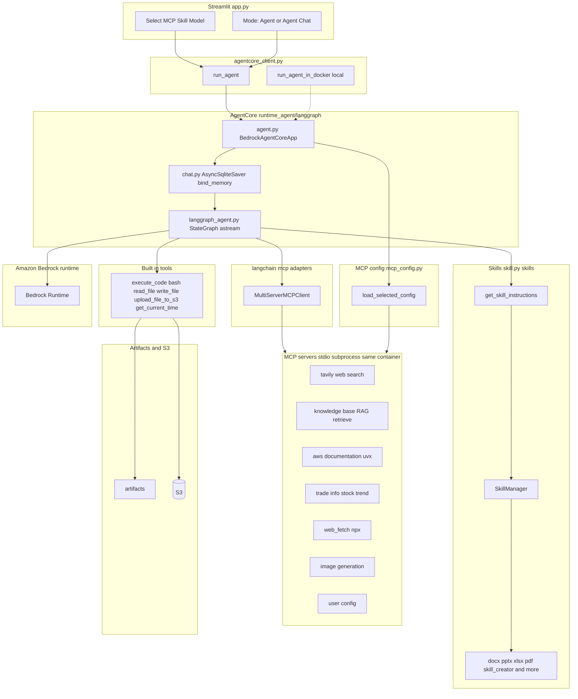
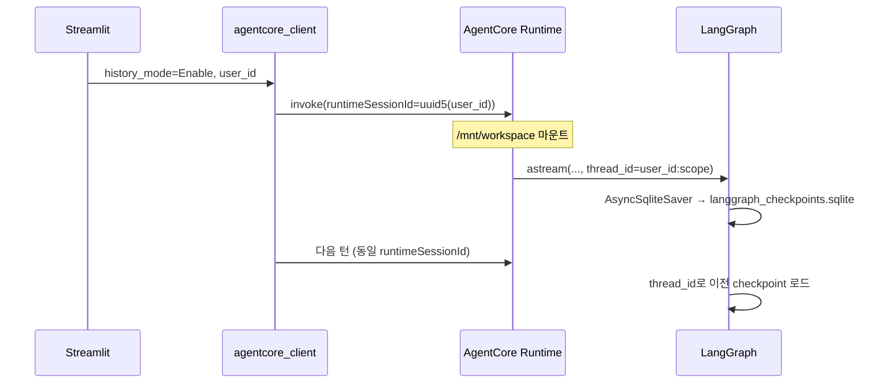

# Power Agent의 AgentCore 배포 및 활용

여기에서는 Streamlit app은 Amazon ECS에 배포하고, Agent는 AgentCore Runtime을 활용해 배포합니다. 

## 주요 구현 

### 전체 Architecture

전체적인 Architecture는 아래와 같습니다. 여기서는 MCP/SKILL를 지원하는 LangGraph agent를 [AgentCore](https://docs.aws.amazon.com/bedrock-agentcore/latest/devguide/what-is-bedrock-agentcore.html)를 이용해 배포하고, Amazon ECS에 배포된 streamlit 애플리케이션에서 활용합니다. AWS 인프라는 루트 [installer.py](./installer.py)로 배포하고, LangGraph agent 이미지는 [Dockerfile](./runtime_agent/langgraph/Dockerfile)로 빌드한 뒤 [installer.py](./runtime_agent/langgraph/installer.py)로 AgentCore Runtime에 배포합니다. Streamlit UI는 루트 [Dockerfile](./Dockerfile)로 ECS에 배포하며, Agent 추론은 AgentCore에서 수행합니다. 애플리케이션에서 AgentCore의 runtime을 호출할 때에는 [bedrock-agentcore](https://boto3.amazonaws.com/v1/documentation/api/latest/reference/services/bedrock-agentcore.html)의 [invoke_agent_runtime](https://boto3.amazonaws.com/v1/documentation/api/latest/reference/services/bedrock-agentcore/client/invoke_agent_runtime.html)을 이용합니다. 이때에 각 agent를 생성할 때에 확인할 수 있는 [agentRuntimeArn](https://docs.aws.amazon.com/bedrock-agentcore-control/latest/APIReference/API_Agent.html)을 이용합니다. Agent는 [MCP](https://modelcontextprotocol.io/introduction)을 이용해 RAG, AWS Document, Tavily와 같은 검색 서비스를 활용할 수 있습니다. RAG는 Bedrock Knowledge Base와 S3 Vectors를 사용하며, Agent에 필요한 S3, CloudFront, VPC, ECS, ECR 등의 배포는 루트 [installer.py](./installer.py)로 수행합니다.


AgentCore의 runtime은 배포를 위해 Docker를 이용합니다. 현재(2025.7) 기준으로 arm64와 1GB 이하의 docker image를 지원합니다.
 
### Operation Architecture

Streamlit UI(`application/app.py`)에서 MCP·Skill·모델·대화 모드를 선택하면 `application/agentcore_client.py`가 AgentCore Runtime(`invoke_agent_runtime`)으로 요청을 보냅니다. Runtime은 `runtime_agent/langgraph/agent.py`의 `BedrockAgentCoreApp` 엔트리포인트에서 LangGraph 워크플로우를 실행하고, 선택된 MCP는 `runtime_agent/langgraph/mcp_config.py`에 따라 **동일 컨테이너 내 stdio 서브프로세스**로 기동됩니다. Skill은 `runtime_agent/langgraph/skills/`의 `SKILL.md`와 `get_skill_instructions` 도구로 제공되며, MCP와는 별도 체계입니다.



| 모드 | 모듈 | 설명 |
|------|------|------|
| **Agent** | `application/app.py` → `agentcore_client.run_agent` | 단일 턴 Agent. `history_mode=Disable`로 매 요청을 독립 처리 |
| **Agent (Chat)** | `application/app.py` → `agentcore_client.run_agent` | 대화 이력 유지. `history_mode=Enable`로 세션 기반 interactive 대화 |
| LangGraph Runtime | `runtime_agent/langgraph/agent.py` | LangGraph StateGraph + `MultiServerMCPClient` + 내장 도구 |
| Skill | `runtime_agent/langgraph/skill.py` · `runtime_agent/langgraph/skills/` | `SKILL.md` 기반 지침. UI `application/skills.list`에서 선택 후 `get_skill_instructions`로 로드 |
| MCP (로컬 stdio) | `runtime_agent/langgraph/mcp_server_*.py` | Agent 컨테이너 안에서 subprocess로 기동 (`runtime_agent/langgraph/mcp_config.py`가 command/args 정의) |
| Streamlit 앱 | 루트 `Dockerfile` → ECS | Streamlit용 최소 패키지. Agent 추론은 AgentCore에서 수행 |

UI에서 MCP는 `application/mcp.list` 기준으로 `tavily`, `knowledge base`, `aws documentation`, `trade info`, `web_fetch`, `image generation`, `사용자 설정`을 체크박스로 선택합니다. Skill은 `application/skills.list`에서 `docx`, `pptx`, `xlsx`, `skill-creator` 등을 별도로 선택합니다. 로컬 개발 시에는 `application/agentcore_client.py`의 `run_agent_in_docker`로 `runtime_agent/langgraph/Dockerfile` 이미지(`localhost:8080`)에 직접 요청할 수 있습니다.

### AgentCore 소개

- AgentCore Runtime: AI agent와 tool을 배포하고 트래픽에 따라 자동으로 확장(Scaling)이 가능한 serverless runtime입니다. LangGraph, CrewAI, Strands Agents를 포함한 다양한 오픈소스 프레임워크을 지원합니다. 빠른 cold start, 세션 격리, 내장된 신원 확인(built-in identity), multimodal payload를 지원합니다. 이를 통해 안전하고 빠른 출시가 가능합니다.
- AgentCore Memory: Agent가 편리하게 short term, long term 메모리를 관리할 수 있습니다.
- AgentCore Code Interpreter: 분리된 sandbox 환경에서 안전하게 코드를 실행할 수 있습니다.
- AgentCore Broswer: 브라우저를 이용해 빠르고 안전하게 웹크롤링과 같은 작업을 수행할 수 있습니다.
- AgentCore Gateway: API, Lambda를 비롯한 서비스들을 쉽게 Tool로 활용할 수 있습니다.
- AgentCore Observability: 상용 환경에서 개발자가 agent의 동작을 trace, debug, monitor 할 수 있습니다.


## Agent 구현

AgentCore는 SSE 방식의 stream을 제공합니다. 

### LangGraph Agent

아래는 LangGraph로 구현한 ReAct agent입니다. 

```python
def buildChatAgentWithHistory(tools):
    tool_node = ToolNode(tools)

    workflow = StateGraph(State)

    workflow.add_node("agent", call_model)
    workflow.add_node("action", tool_node)
    workflow.add_edge(START, "agent")
    workflow.add_conditional_edges(
        "agent",
        should_continue,
        {
            "continue": "action",
            "end": END,
        },
    )
    workflow.add_edge("action", "agent")

    return workflow.compile(
        checkpointer=chat.checkpointer
    )
```


[runtime_agent/langgraph/agent.py](./runtime_agent/langgraph/agent.py)와 같이 stream 방식으로 처리하면 agent가 좀 더 동적으로 동작하게 할 수 있습니다. 아래와 같이 MCP 서버의 정보로 json 파일을 만든 후에 MultiServerMCPClient으로 client를 설정하고 나서 agent를 생성합니다. 이후 stream을 이용해 출력할때 json 형태의 결과값을 stream으로 전달합니다. 

```python
from bedrock_agentcore.runtime import BedrockAgentCoreApp
app = BedrockAgentCoreApp()

@app.entrypoint
async def agent_langgraph(payload):
    mcp_json = mcp_config.load_selected_config(mcp_servers)
    server_params = load_multiple_mcp_server_parameters(mcp_json)
    client = MultiServerMCPClient(server_params)

    app = buildChatAgentWithHistory(tools)
    config = {
        "recursion_limit": 50,
        "configurable": {"thread_id": user_id},
        "tools": tools
    }    
    inputs = {
        "messages": [HumanMessage(content=query)]
    }
            
    value = None
    async for output in app.astream(inputs, config):
        for key, value in output.items():
            logger.info(f"--> key: {key}, value: {value}")

            if "messages" in value:
                for message in value["messages"]:
                    if isinstance(message, AIMessage):
                        yield({'data': message.content})
                        tool_calls = message.tool_calls
                        if tool_calls:
                            for tool_call in tool_calls:
                                tool_name = tool_call["name"]
                                tool_content = tool_call["args"]
                                toolUseId = tool_call["id"]
                                yield({'tool': tool_name, 'input': tool_content, 'toolUseId': toolUseId})
                    elif isinstance(message, ToolMessage):
                        toolResult = message.content
                        toolUseId = message.tool_call_id
                        yield({'toolResult': toolResult, 'toolUseId': toolUseId})
```

### Client

AgentCore로 agent_runtime_arn을 이용해 request에 대한 응답을 얻습니다. 이때 content-type이 "text/event-stream"인 경우에 prefix인 "data:"를 제거한 후에 json parser를 이용해 얻어진 값을 목적에 맞게 활용합니다.

```python
agent_core_client = boto3.client('bedrock-agentcore', region_name=bedrock_region)
response = agent_core_client.invoke_agent_runtime(
    agentRuntimeArn=agent_runtime_arn,
    runtimeSessionId=runtime_session_id,
    payload=payload,
    qualifier="DEFAULT" # DEFAULT or LATEST
)

result = current = ""
processed_data = set()  # Prevent duplicate data

# stream response
if "text/event-stream" in response.get("contentType", ""):
    for line in response["response"].iter_lines(chunk_size=10):
        line = line.decode("utf-8")        
        if line.startswith('data: '):
            data = line[6:].strip()  # Remove "data:" prefix and whitespace
            if data:  # Only process non-empty data
                # Check for duplicate data
                if data in processed_data:
                    continue
                processed_data.add(data)
                
                data_json = json.loads(data)
                if 'data' in data_json:
                    text = data_json['data']
                    logger.info(f"[data] {text}")
                    current += text
                    containers['result'].markdown(current)
                elif 'result' in data_json:
                    result = data_json['result']
                elif 'tool' in data_json:
                    tool = data_json['tool']
                    input = data_json['input']
                    toolUseId = data_json['toolUseId']
                    if toolUseId not in tool_info_list: # new tool info
                        tool_info_list[toolUseId] = index                                        
                        add_notification(containers, f"Tool: {tool}, Input: {input}")
                    else: # overwrite tool info
                        containers['notification'][tool_info_list[toolUseId]].info(f"Tool: {tool}, Input: {input}")                    
                elif 'toolResult' in data_json:
                    toolResult = data_json['toolResult']
                    toolUseId = data_json['toolUseId']
                    if toolUseId not in tool_result_list:  # new tool result
                        tool_result_list[toolUseId] = index
                        add_notification(containers, f"Tool Result: {toolResult}")
                    else: # overwrite tool result
                        containers['notification'][tool_result_list[toolUseId]].info(f"Tool Result: {toolResult}")
```


## Runtime Agent

LangGraph agent는 [runtime_agent/langgraph/](./runtime_agent/langgraph/)에 구현되어 있으며, AgentCore Runtime 컨테이너에서 `agent.py`의 `BedrockAgentCoreApp` 엔트리포인트로 실행됩니다.

### IAM 인증

LangGraph agent에 대한 이미지를 [runtime_agent/langgraph/Dockerfile](./runtime_agent/langgraph/Dockerfile)을 이용해 빌드후 ECR에 배포합니다. 또한, Agent Runtime 배포 시 IAM 인증을 사용합니다. [create_agent_runtime](https://boto3.amazonaws.com/v1/documentation/api/latest/reference/services/bedrock-agentcore-control/client/create_agent_runtime.html)에서 authorizerConfiguration을 포함하지 않은 경우에 IAM으로 인증하게 됩니다. Runtime 생성시 client는 bedrock-agentcore-control을 사용하고 Agent 이미지에 대한 ECR 경로를 가지고 있어야 합니다. 

Agent에서 외부 AgentCore endpoint로 요청을 보낼때에는 아래와 같이 IAM 인증을 수행하기 위하여 request에 X-Amz-Security-Token을 포함합니다. 이를 위해 httpx의 event hook을 이용해 아래와 같이 구현할 수 있습니다. 상세코드는 [runtime_agent/langgraph/agent.py](./runtime_agent/langgraph/agent.py)을 참조합니다.

```python
original_init = httpx.AsyncClient.__init__
def patched_init(self, *args, **kwargs):
    # Add SigV4 signing event hook if needed
    async def sign_request(request: httpx.Request) -> None:
        """Sign the request with AWS SigV4 including the body"""
        # Only sign requests to bedrock-agentcore
        if "bedrock-agentcore" not in str(request.url):
            return
        
        # Get credentials
        boto_session = boto3.Session()
        credentials = boto_session.get_credentials().get_frozen_credentials()
        
        # Parse URL
        parsed_url = urlparse(str(request.url))
        host = parsed_url.netloc
        
        # Generate timestamp
        timestamp = datetime.now(timezone.utc).strftime('%Y%m%dT%H%M%SZ')
        
        # Read request body if available
        body = None
        if request.content:
            if isinstance(request.content, bytes):
                body = request.content
            else:
                try:
                    body = await request.aread()
                    if hasattr(request, '_content'):
                        request._content = body
                except Exception:
                    pass
        
        # Create AWS request headers
        aws_headers = {
            'host': host,
            'x-amz-date': timestamp,
            'Content-Type': request.headers.get('Content-Type', 'application/json'),
            'Accept': request.headers.get('Accept', 'application/json, text/event-stream')
        }
        
        if body:
            aws_headers['Content-Length'] = str(len(body))
        
        # Create AWS request for signing
        aws_request = AWSRequest(
            method=request.method,
            url=str(request.url),
            headers=aws_headers,
            data=body
        )
        
        # Sign the request
        region = utils.load_config().get("region", "us-west-2")
        auth = BotocoreSigV4Auth(credentials, "bedrock-agentcore", region)
        auth.add_auth(aws_request)
        
        # Update request headers
        request.headers['X-Amz-Date'] = timestamp
        request.headers['Authorization'] = aws_request.headers['Authorization']
        
        if credentials.token:
            request.headers['X-Amz-Security-Token'] = credentials.token
    
    # Add event_hooks to kwargs if not already present
    if 'event_hooks' not in kwargs:
        kwargs['event_hooks'] = {'request': [], 'response': []}
    elif not isinstance(kwargs['event_hooks'], dict):
        kwargs['event_hooks'] = {'request': [], 'response': []}
    
    if 'request' not in kwargs['event_hooks']:
        kwargs['event_hooks']['request'] = []
    
    # Add the sign_request hook
    kwargs['event_hooks']['request'].append(sign_request)

    # Call original init with modified kwargs
    original_init(self, *args, **kwargs)
```

Streamlit에서 입력하면 AgentCore endpoint로 전달되는데 이때에 아래와 같이 BedrockAgentCoreApp의 entrypoint로 받아서 실행합니다.

```python
import httpx
from bedrock_agentcore.runtime import BedrockAgentCoreApp

app = BedrockAgentCoreApp()

@app.entrypoint
async def agent_langgraph(payload):
    httpx.AsyncClient.__init__ = patched_init
    
    client = MultiServerMCPClient(server_params)
    tools = await client.get_tools()
    
    app = langgraph_agent.buildChatAgentWithHistory(tools)
    config = {
        "recursion_limit": 50,
        "configurable": {"thread_id": user_id},
        "tools": tools,
        "system_prompt": None
    }
    
    inputs = {"messages": [HumanMessage(content=query)]}
            
    value = final_output = None
    async for output in app.astream(inputs, config):
        for key, value in output.items():
            logger.info(f"--> key: {key}, value: {value}")

            if key == "messages" or key == "agent":
                if isinstance(value, dict) and "messages" in value:
                    final_output = value
                elif isinstance(value, list):
                    final_output = {"messages": value, "image_url": []}
                else:
                    final_output = {"messages": [value], "image_url": []}
```


## Session Storage

AgentCore Runtime에서 대화 context를 유지하려면 **Session Storage**를 사용합니다. `create_agent_runtime` 시 `filesystemConfigurations`에 `sessionStorage`를 설정하면, `invoke_agent_runtime`의 **`runtimeSessionId`마다** 컨테이너에 임시 디스크가 마운트됩니다. 이 프로젝트에서는 LangGraph checkpointer가 해당 경로의 SQLite 파일에 대화 이력을 저장합니다.

### Runtime 생성 시 sessionStorage 설정

[runtime_agent/langgraph/installer.py](./runtime_agent/langgraph/installer.py)에서 runtime을 생성할 때 아래와 같이 `/mnt/workspace`를 마운트합니다. (`/mnt/` 하위 경로 필수)

```python
client = boto3.client('bedrock-agentcore-control', region_name=aws_region)

response = client.create_agent_runtime(
    agentRuntimeName=runtime_name,
    agentRuntimeArtifact={
        'containerConfiguration': {
            'containerUri': f"{account_id}.dkr.ecr.{aws_region}.amazonaws.com/{repository_name}:{image_tag}"
        }
    },
    filesystemConfigurations=[
        {
            "sessionStorage": {
                "mountPath": "/mnt/workspace"
            }
        }
    ],
    networkConfiguration={"networkMode": "PUBLIC"},
    roleArn=agent_runtime_role
)
```

### LangGraph checkpointer 연동

기존 `MemorySaver`는 프로세스 메모리에만 저장되어 컨테이너가 재시작되면 history가 사라집니다. `history_mode=Enable`일 때 [runtime_agent/langgraph/chat.py](./runtime_agent/langgraph/chat.py)의 `ensure_checkpointer()`가 **AsyncSqliteSaver**를 초기화하고, `buildChatAgentWithHistory()`가 이를 checkpointer로 사용합니다.

| 구분 | Strands (참고) | LangGraph (본 프로젝트) |
|------|----------------|-------------------------|
| 저장소 | `FileSessionManager(storage_dir="/mnt/workspace")` | `AsyncSqliteSaver` → `/mnt/workspace/langgraph_checkpoints.sqlite` |
| 세션 키 | `session_id` | `config["configurable"]["thread_id"]` |

```python
# chat.py — 요약
SESSION_STORAGE_DIR = os.environ.get("SESSION_STORAGE_DIR", "/mnt/workspace")
CHECKPOINT_DB = os.path.join(SESSION_STORAGE_DIR, "langgraph_checkpoints.sqlite")

async def ensure_checkpointer():
    saver = AsyncSqliteSaver.from_conn_string(CHECKPOINT_DB)
    checkpointer = await saver.__aenter__()
    await checkpointer.setup()
    return checkpointer
```

`buildChatAgentWithHistory()`는 아래와 같이 checkpointer를 compile 시 전달합니다.

```python
return workflow.compile(
    checkpointer=chat.checkpointer
)
```


### 클라이언트 runtimeSessionId

Streamlit 클라이언트([application/agentcore_client.py](./application/agentcore_client.py))는 history 모드에서 **user_id 기반 고정 `runtimeSessionId`**를 사용합니다. 같은 사용자가 재접속해도 동일한 `/mnt/workspace`가 붙어 SQLite checkpoint를 이어서 읽을 수 있습니다.

```python
def runtime_session_id_for(user_id: str, history_mode: str) -> str:
    if history_mode == "Enable" and user_id:
        seed = f"agentcore-session-{user_id}"
        session_id = str(uuid.uuid5(uuid.NAMESPACE_DNS, seed))
    else:
        session_id = str(uuid.uuid4())
    return session_id
```



### 환경 변수

| 변수 | 기본값 | 설명 |
|------|--------|------|
| `SESSION_STORAGE_DIR` | `/mnt/workspace` | checkpoint SQLite 디렉터리 |
| `SESSION_STORAGE_ENABLED` | `true` | `false`이면 `MemorySaver`로 폴백 |

로컬에서 session storage 없이 실행할 때는 `SESSION_STORAGE_DIR`이 없으면 `runtime_agent/langgraph/.session_storage`를 사용합니다.

### 주의사항

- **세션 범위**: `/mnt/workspace`는 `runtimeSessionId` 수명에 묶인 **임시 저장소**입니다. 일반적으로 세션이 종료되면 데이터가 사라지지만, AgentCore를 사용할 경우에는 14일간 보관이 됩니다. 추가 입력이 있을 경우에 기간은 다시 14일로 갱신됩니다. 세션당 최대 1MB까지 저장합니다. 다른 방법으로 S3, DynamoDB, RDS 등을 별도로 설정할 수 있습니다.
- **요청마다 agent 재생성**: `agent.py`는 매 요청 `create_agent()`를 호출하지만, checkpointer가 파일에 있으면 `thread_id`만 같으면 history를 복원합니다.
- **`InMemoryStore`는 휘발성**: `store=chat.memorystore`는 LangGraph Store API용이며 메모리에만 있습니다. 대화 history만 필요하면 checkpointer만으로 충분합니다.
- **의존성**: [runtime_agent/langgraph/Dockerfile](./runtime_agent/langgraph/Dockerfile)에 `langgraph-checkpoint-sqlite`, `aiosqlite`가 포함되어 있습니다.


### 세션 관리

AgentCore Runtime에서 대화 history를 유지하려면 **managed session storage**(`filesystemConfigurations.sessionStorage`)와 **동일한 `runtimeSessionId`**, 그리고 LangGraph **checkpointer**(SQLite)가 함께 동작해야 합니다. 상세 구현은 위 [Session Storage](#session-storage) 절을 참조합니다.

#### sessionStorage (managed session storage)

[AWS 문서](https://docs.aws.amazon.com/bedrock-agentcore/latest/devguide/runtime-filesystem-configurations.html)에 따르면, `sessionStorage`는 **runtimeSessionId마다** 격리된 persistent 디렉터리(`/mnt/workspace` 등)를 제공합니다. agent가 일반 파일 I/O로 쓴 내용은 서비스가 durable storage에 비동기 복제하고, microVM이 stop/resume(cold start)되어도 **같은 `runtimeSessionId`로 invoke하면** 파일 상태가 복원됩니다.

| 항목 | 내용 |
|------|------|
| 설정 위치 | `create_agent_runtime` / `update_agent_runtime`의 `filesystemConfigurations` |
| mount path | `/mnt/` 하위 1단계 필수 (예: `/mnt/workspace`) |
| 세션 격리 | `runtimeSessionId`마다 별도 storage (세션 간 공유 불가) |
| session당 용량 | 최대 1 GB |
| idle 만료 | **14일**간 invoke 없으면 데이터 삭제 |
| version 업데이트 | **agent runtime version 변경 시 session data 초기화** |

**stop/resume lifecycle (AWS):**

1. 첫 invoke — microVM 생성, mount path는 빈 디렉터리
2. agent write — 로컬 파일 시스템에 쓰기, durable storage로 비동기 복제
3. session stop — microVM 종료, 미 flush 데이터는 graceful shutdown 시 flush
4. 같은 session resume — 새 microVM에 storage 복원

본 프로젝트는 `/mnt/workspace/langgraph_checkpoints.sqlite`에 LangGraph checkpoint를 저장합니다. cold start 후 `ensure_checkpointer()` 로그가 `opened (existing)`이면 복원 성공, `initialized`이면 **새 DB 생성(이전 history 없음)** 입니다.

> **중요:** Dockerfile의 `ENV SESSION_STORAGE_DIR=/mnt/workspace`만으로는 영속 storage가 활성화되지 않습니다. **반드시** runtime API에 `filesystemConfigurations.sessionStorage`를 설정해야 합니다. `create_agent_runtime`뿐 아니라 **`update_agent_runtime`에도 동일하게 포함**해야 합니다. update 시 누락하면 `get-agent-runtime` 응답에 `filesystemConfigurations`가 없고, cold start마다 checkpoint가 사라집니다.

#### maxLifetime · idleRuntimeSessionTimeout (lifecycle)

[Lifecycle settings](https://docs.aws.amazon.com/bedrock-agentcore/latest/devguide/runtime-lifecycle-settings.html)의 **8시간**은 checkpoint **데이터 보관 기간이 아닙니다.** microVM **인스턴스 최대 수명**입니다.

| 설정 | 기본값 | 의미 |
|------|--------|------|
| `idleRuntimeSessionTimeout` | 900초 (**15분**) | idle 상태가 이 시간 지속되면 해당 session의 microVM 종료 |
| `maxLifetime` | 28,800초 (**8시간**) | microVM이 한 번 생성된 뒤 살아 있을 수 있는 **최대 시간** (리셋 불가) |

- idle timeout 도달 → microVM만 종료. sessionStorage가 설정되어 있고 **같은 `runtimeSessionId`**로 다시 invoke하면 storage가 복원되어야 합니다.
- maxLifetime 도달 → microVM 교체. session 자체는 새 microVM으로 **resume 가능** (문서: *"The session itself can persist beyond this with a new instance provisioned."*)
- idle timer는 **같은 session에 invoke할 때마다 리셋**됩니다.

#### runtimeSessionId (클라이언트)

[application/agentcore_client.py](./application/agentcore_client.py)의 `runtime_session_id_for()`는 history 모드에서 user_id 기반 **고정 UUID**를 생성합니다. sessionStorage 복원은 **invoke마다 동일한 `runtimeSessionId`**가 전달될 때만 동작합니다.

- history 모드에서 `runtimeSessionId`는 `user_id`만으로 고정 (`agentcore_client.py`)

#### 배포·운영 체크리스트

1. `get-agent-runtime`으로 `filesystemConfigurations`에 `sessionStorage` 존재 확인
2. create/update 모두 `/mnt/workspace` mount path 포함
3. history 모드에서 `runtimeSessionId`가 user_id마다 고정인지 확인
4. runtime **version 업데이트 직후**에는 session data가 wipe됨 (정상 동작)
5. CloudWatch(`/aws/bedrock-agentcore/runtimes/...`)에서 `checkpointer` 로그로 `initialized` vs `opened (existing)` 확인

#### 참고 문서

- [File system configurations for AgentCore Runtime](https://docs.aws.amazon.com/bedrock-agentcore/latest/devguide/runtime-filesystem-configurations.html)
- [Configure lifecycle settings](https://docs.aws.amazon.com/bedrock-agentcore/latest/devguide/runtime-lifecycle-settings.html)
- [AgentCore quotas (session storage limits)](https://docs.aws.amazon.com/bedrock-agentcore/latest/devguide/bedrock-agentcore-limits.html)


## 배포하기

아래와 같이 EC2를 이용해 배포 환경을 구성합니다.

1. AWS Console의 EC2에 접속해서 [Launch instance]를 선택합니다.
2. EC2 생성시 Architecture로 Arm64을 선택하고 나머지는 기본값으로 생성합니다.
3. [EC2 Instance Connect]로 접속해서 아래와 같이 python, pip, git, boto3를 설치합니다.

```text
sudo yum install python3 python3-pip git 
pip install boto3 
```

4. 아래 명령어로 docker를 설치합니다.

```bash
sudo yum install -y docker
sudo systemctl start docker
sudo systemctl enable docker
sudo usermod -aG docker ec2-user
newgrp docker
docker info
```

5. 아래와 같이 git source를 가져옵니다.

```bash
git clone https://github.com/kyopark2014/power-runtime
cd power-runtime
```

6. 아래와 같이 [installer.py](./installer.py)를 이용해 설치를 시작합니다.

```bash
python3 installer.py
```


설치가 완료되면 CloudFront로 접속하여 동작을 확인합니다. 

접속한 후 아래와 같이 Agent를 선택한 후에 적절한 MCP tool을 선택하여 원하는 작업을 수행합니다.

인프라가 더이상 필요없을 때에는 루트 [uninstaller.py](./uninstaller.py)를 이용해 제거합니다.

```bash
python3 uninstaller.py
```

### Knowledge Base 문서 동기화 하기 

Knowledge Base에서 문서를 활용하기 위해서는 S3에 문서 등록 및 동기화기 필요합니다. [S3 Console](https://us-west-2.console.aws.amazon.com/s3/home?region=us-west-2)에 접속하여 `storage-for-power-runtime-{account_id}-us-west-2` 형식의 버킷(예: `storage-for-power-runtime-xxxxxxxxxxxx-us-west-2`)을 선택하고, 아래와 같이 docs폴더를 생성한 후에 파일을 업로드 합니다. 


이후 [Knowledge Bases Console](https://us-west-2.console.aws.amazon.com/bedrock/home?region=us-west-2#/knowledge-bases)에 접속하여, `power-runtime`이라는 Knowledge Base를 선택합니다. 이후 아래와 같이 [Sync]를 선택합니다.


### Local에서 실행하기

AWS 환경을 잘 활용하기 위해서는 [AWS CLI를 설치](https://docs.aws.amazon.com/ko_kr/cli/v1/userguide/cli-chap-install.html)하여야 합니다. EC2에서 배포하는 경우에는 별도로 설치가 필요하지 않습니다. Local에 설치시는 아래 명령어를 참조합니다.

```text
curl "https://awscli.amazonaws.com/awscli-exe-linux-x86_64.zip" -o "awscliv2.zip" 
unzip awscliv2.zip
sudo ./aws/install
```

AWS credential을 아래와 같이 AWS CLI를 이용해 등록합니다.

```text
aws configure
```

설치하다가 발생하는 각종 문제는 [Kiro-cli](https://aws.amazon.com/ko/blogs/korea/kiro-general-availability/)를 이용해 빠르게 수정합니다. 아래와 같이 설치할 수 있지만, Windows에서는 [Kiro 설치](https://kiro.dev/downloads/)에서 다운로드 설치합니다. 실행시는 셀에서 "kiro-cli"라고 입력합니다. 

```python
curl -fsSL https://cli.kiro.dev/install | bash
```

venv로 환경을 구성하면 편리하게 패키지를 관리합니다. 아래와 같이 환경을 설정합니다.

```text
python -m venv .venv
source .venv/bin/activate
```

이후 다운로드 받은 github 폴더로 이동한 후에 아래와 같이 필요한 패키지를 추가로 설치 합니다.

```text
pip install -r requirements.txt
```

이후 아래와 같은 명령어로 streamlit을 실행합니다. 

```text
streamlit run application/app.py
```


### 비동기 실행

에이전트가 즉시 응답하고 백그라운드에서 계속 처리할 수 있습니다. 클라이언트는 동기/비동기 구분 없이 동일한 API 사용가능하고, 세션을 재사용하여 컨텍스트 유지합니다.

```python
import threading
import time
from strands import Agent, tool
from bedrock_agentcore.runtime import BedrockAgentCoreApp

app = BedrockAgentCoreApp()

@tool
def start_background_task(duration: int = 5) -> str:
    """백그라운드에서 지정된 시간 동안 실행되는 태스크 시작"""

    # 비동기 태스크 등록
    task_id = app.add_async_task("background_processing", {"duration": duration})

    # 별도 스레드에서 백그라운드 작업 실행
    def background_work():
        time.sleep(duration)  # 실제 작업 수행
        app.complete_async_task(task_id)  

    threading.Thread(target=background_work, daemon=True).start()

    return f"백그라운드 태스크 시작됨 (ID: {task_id}), {duration}초 후 완료 예정"

agent = Agent(tools=[start_background_task])

@app.entrypoint
def main(payload):
    user_message = payload.get("prompt", "3초짜리 태스크를 시작해줘")
    return {"message": agent(user_message).message}

if __name__ == "__main__":
    app.run()
```

## 실행 결과

"https://github.com/kyopark2014/strands-runtime/blob/main/README.md 을 정리해줘."와 같이 입력하면 웹의 정보를 편리하게 활용할 수 있습니다.


이때의 결과는 아래와 같습니다.


"aws document로 agent evalutation 에 대해 조사해줘."로 하면 필요한 정보를 조회하여 정리합니다.


## Reference 

[Invoke streaming agents](https://docs.aws.amazon.com/bedrock-agentcore/latest/devguide/runtime-invoke-agent.html)

[Get started with the Amazon Bedrock AgentCore Runtime starter toolkit](https://docs.aws.amazon.com/bedrock-agentcore/latest/devguide/runtime-getting-started-toolkit.html)

[Amazon Bedrock AgentCore - Developer Guide](https://docs.aws.amazon.com/pdfs/bedrock-agentcore/latest/devguide/bedrock-agentcore-dg.pdf)

[BedrockAgentCoreControlPlaneFrontingLayer](https://boto3.amazonaws.com/v1/documentation/api/latest/reference/services/bedrock-agentcore-control.html)

[get_agent_runtime](https://boto3.amazonaws.com/v1/documentation/api/latest/reference/services/bedrock-agentcore-control/client/get_agent_runtime.html)

[Amazon Bedrock AgentCore Samples](https://github.com/awslabs/amazon-bedrock-agentcore-samples)

[Amazon Bedrock AgentCore](https://buttoned-gull-5fa.notion.site/Amazon-Bedrock-AgentCore-23708996fdd380c2a6e1ffaa2e08c000)

[Amazon Bedrock AgentCore RuntCode Interpreter](https://github.com/awslabs/amazon-bedrock-agentcore-samples/tree/main/01-tutorials/05-AgentCore-tools/01-Agent-Core-code-interpreter)

[Add observability to your Amazon Bedrock AgentCore resources](https://docs.aws.amazon.com/bedrock-agentcore/latest/devguide/observability-configure.html)

[Hosting Strands Agents with Amazon Bedrock models in Amazon Bedrock AgentCore Runtime](https://github.com/awslabs/amazon-bedrock-agentcore-samples/blob/main/01-tutorials%2F06-AgentCore-observability%2F01-Agentcore-runtime-hosted%2Fruntime_with_strands_and_bedrock_models.ipynb)

[Agentic AI 펀드 매니저](https://github.com/ksgsslee/investment_advisor_strands)

[AWS re:Invent 2025 - Architecting scalable and secure agentic AI with Bedrock AgentCore (AIM431)](https://www.youtube.com/watch?v=wqmeZOT6mmc)


[Deploy Production-Ready Agents in 22 Minutes with AgentCore Runtime](https://www.youtube.com/watch?v=Q-tYIAuv9WI)

[AgentCore Workshop](https://atomoh.gitbook.io/aiops)

