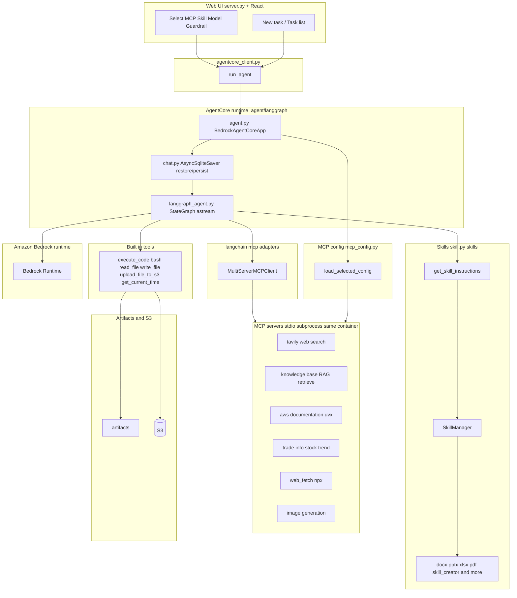
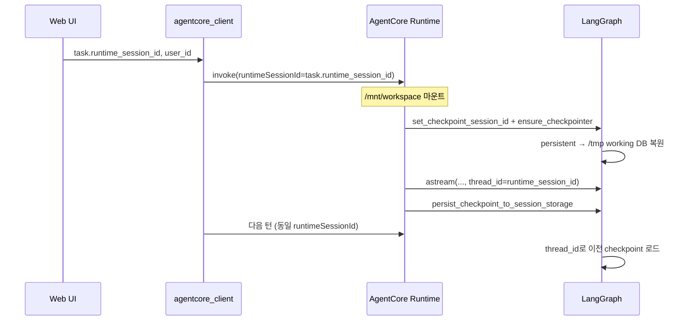
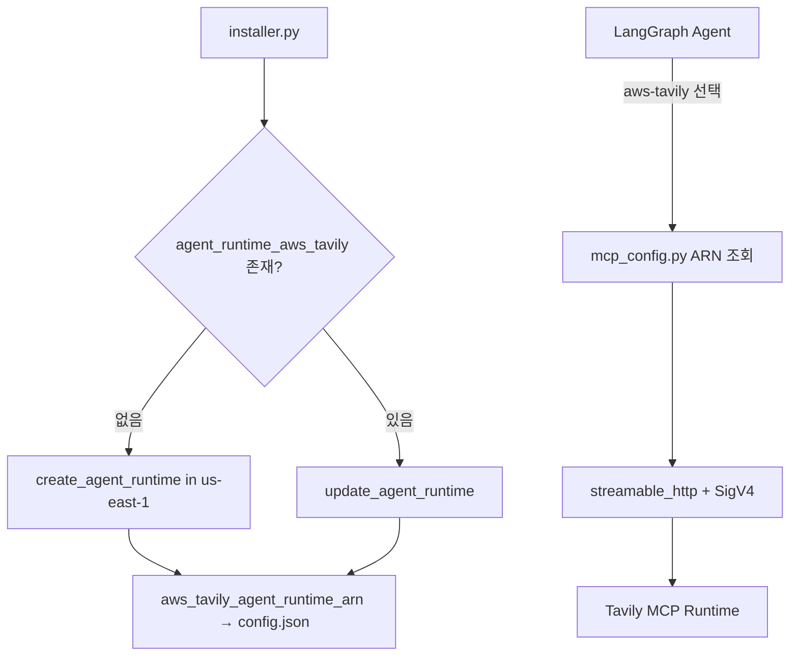
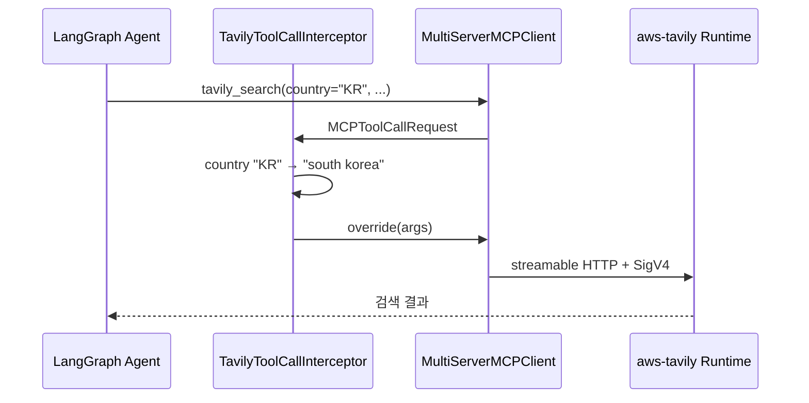

# Power Agent의 AgentCore 배포 및 활용

여기에서는 Web UI(FastAPI + React)를 Amazon ECS에 배포하고, Agent는 AgentCore Runtime을 활용해 배포합니다. 

## 주요 구현 

### 전체 Architecture

전체적인 Architecture는 아래와 같습니다. 여기서는 MCP/SKILL를 지원하는 LangGraph agent를 [AgentCore](https://docs.aws.amazon.com/bedrock-agentcore/latest/devguide/what-is-bedrock-agentcore.html)를 이용해 배포하고, Amazon ECS에 배포된 Web UI 애플리케이션에서 활용합니다. AWS 인프라는 루트 [installer.py](./installer.py)로 배포하고, LangGraph agent 이미지는 [Dockerfile](./runtime_agent/langgraph/Dockerfile)로 빌드한 뒤 [installer.py](./runtime_agent/langgraph/installer.py)로 AgentCore Runtime에 배포합니다. Web UI는 루트 [Dockerfile](./Dockerfile)로 ECS에 배포하며, Agent 추론은 AgentCore에서 수행합니다. 애플리케이션에서 AgentCore의 runtime을 호출할 때에는 [bedrock-agentcore](https://boto3.amazonaws.com/v1/documentation/api/latest/reference/services/bedrock-agentcore.html)의 [invoke_agent_runtime](https://boto3.amazonaws.com/v1/documentation/api/latest/reference/services/bedrock-agentcore/client/invoke_agent_runtime.html)을 이용합니다. 이때에 각 agent를 생성할 때에 확인할 수 있는 [agentRuntimeArn](https://docs.aws.amazon.com/bedrock-agentcore-control/latest/APIReference/API_Agent.html)을 이용합니다. Agent는 [MCP](https://modelcontextprotocol.io/introduction)을 이용해 RAG, AWS Document, Tavily와 같은 검색 서비스를 활용할 수 있습니다. RAG는 Bedrock Knowledge Base와 S3 Vectors를 사용하며, Agent에 필요한 S3, CloudFront, VPC, ECS, ECR 등의 배포는 루트 [installer.py](./installer.py)로 수행합니다.


AgentCore의 runtime은 배포를 위해 Docker를 이용합니다. 현재(2025.7) 기준으로 arm64와 1GB 이하의 docker image를 지원합니다.
 
### Operation Architecture

Web UI(`application/server.py`, `application/web/`)에서 MCP·Skill·모델을 선택하면 `application/agentcore_client.py`가 AgentCore Runtime(`invoke_agent_runtime`)으로 요청을 보냅니다. New task마다 별도 `runtimeSessionId`로 checkpoint가 격리됩니다. Runtime은 `runtime_agent/langgraph/agent.py`의 `BedrockAgentCoreApp` 엔트리포인트에서 LangGraph 워크플로우를 실행하고, 선택된 MCP는 `runtime_agent/langgraph/mcp_config.py`에 따라 **동일 컨테이너 내 stdio 서브프로세스** 또는 **원격 AgentCore MCP(aws-tavily)** 로 기동됩니다. Skill은 `runtime_agent/langgraph/skills/`의 `SKILL.md`와 `get_skill_instructions` 도구로 제공되며, MCP와는 별도 체계입니다.


```mermaid
flowchart TB
  subgraph UI["Web UI server.py + React"]
    TASK["New task / Task list"]
    SEL["Select MCP Skill Model Guardrail"]
  end

  subgraph Client["agentcore_client.py"]
    RA[run_agent]
  end

  subgraph Runtime["AgentCore runtime_agent/langgraph"]
    AG["agent.py BedrockAgentCoreApp"]
    CHAT["chat.py AsyncSqliteSaver restore/persist"]
    LGA["langgraph_agent.py StateGraph astream"]
  end

  subgraph BuiltIn["Built in tools"]
    LGB["execute_code bash read_file write_file upload_file_to_s3 get_current_time"]
  end

  subgraph Skills["Skills skill.py skills"]
    SKM[SkillManager]
    SKT[get_skill_instructions]
    SKD["docx pptx xlsx pdf skill_creator and more"]
  end

  subgraph MCPConfig["MCP config mcp_config.py"]
    LSC[load_selected_config]
  end

  subgraph MCPLocal["MCP servers stdio subprocess same container"]
    TV["tavily web search"]
    KB["knowledge base RAG retrieve"]
    AD["aws documentation uvx"]
    TI["trade info stock trend"]
    WF["web_fetch npx"]
    IG[image generation]
  end

  subgraph MCPClient["langchain mcp adapters"]
    LGM[MultiServerMCPClient]
  end

  subgraph LLM["Amazon Bedrock runtime"]
    BR[Bedrock Runtime]
  end

  subgraph Storage["Artifacts and S3"]
    ART[artifacts]
    S3[(S3)]
  end

  TASK --> RA
  SEL --> RA

  RA --> AG
  AG --> CHAT
  CHAT --> LGA
  LGA --> BR
  LGA --> LGB
  LGA --> LGM
  LGA --> SKT

  SKT --> SKM
  SKM --> SKD

  AG --> LSC
  LSC --> MCPLocal
  LGM --> MCPLocal

  LGB --> ART
  LGB --> S3
```

| 모드 | 모듈 | 설명 |
|------|------|------|
| **Agent (Chat)** | `application/server.py` → `agentcore_client.run_agent` | 태스크별 `runtimeSessionId`로 대화 이력(checkpoint) 유지 |
| LangGraph Runtime | `runtime_agent/langgraph/agent.py` | LangGraph StateGraph + `MultiServerMCPClient` + 내장 도구 |
| Skill | `runtime_agent/langgraph/skill.py` · `runtime_agent/langgraph/skills/` | `SKILL.md` 기반 지침. UI `application/skills.list`에서 선택 후 `get_skill_instructions`로 로드 |
| MCP (로컬 stdio / 원격) | `mcp_config.py`, `mcp_server_*.py`, aws-tavily Runtime | stdio subprocess 또는 AgentCore 원격 MCP |
| Web UI | 루트 `Dockerfile` → ECS | FastAPI + React SPA. Agent 추론은 AgentCore에서 수행 |

UI에서 MCP는 `application/mcp.list` 기준으로 `knowledge base`, `aws documentation`, `trade info`, `web_fetch`, `tavily`, `aws-tavily`, `image generation`, `korea_weather` 등을 선택합니다. Skill은 `application/skills.list`에서 `docx`, `pptx`, `xlsx`, `skill-creator` 등을 별도로 선택합니다. UI는 `agentcore_client.run_agent`로 AgentCore Runtime에 직접 요청합니다.

### 네트워크 설정

`power-runtime`은 **ECS(Web UI)** 와 **AgentCore Runtime(LangGraph 서버)** 가 모두 **private subnet** 에 배포됩니다. 이 환경에서는 인터넷으로 직접 나가지 않으므로, AWS API 호출은 **VPC Interface/Gateway Endpoint** 로, 외부 MCP·npm·cross-region 트래픽은 **NAT Gateway** 로 egress 를 열어야 합니다.

[installer.py](./installer.py) 가 신규 VPC 생성뿐 아니라 **기존 VPC 재사용 시**에도 아래 리소스를 자동으로 맞춥니다.

#### 구성 요약

```text
[사용자] → CloudFront → ALB (public subnet)
                              ↓
                    ECS App (private subnet)
                              ↓ bedrock-agentcore VPC Endpoint
                    AgentCore Runtime (private subnet, VPC mode)
                              ↓
              MCP: aws-tavily (us-east-1 Runtime) / web_fetch (npm)
                              ↓ NAT Gateway (public subnet 경유)
                         Internet
```

| 구성 요소 | Subnet | 인터넷 egress |
|-----------|--------|----------------|
| ALB | Public | IGW |
| ECS Fargate | Private | VPC Endpoint + NAT |
| AgentCore Runtime | Private | VPC Endpoint + NAT |

#### VPC Interface Endpoint (us-west-2)

Private subnet 워크로드가 **같은 리전(us-west-2)** AWS API 에 도달할 때 사용합니다. `ensure_private_subnet_vpc_endpoints()` 가 생성·재사용합니다.

| AWS 서비스 | Endpoint 서비스 이름 | 용도 |
|------------|----------------------|------|
| Amazon ECR API | `com.amazonaws.us-west-2.ecr.api` | ECS/Runtime 이미지 pull 메타데이터 |
| Amazon ECR DKR | `com.amazonaws.us-west-2.ecr.dkr` | 컨테이너 이미지 레이어 pull |
| CloudWatch Logs | `com.amazonaws.us-west-2.logs` | ECS·Runtime 로그 전송 |
| Secrets Manager | `com.amazonaws.us-west-2.secretsmanager` | Runtime cold start 시 Tavily API 키 로드 ([runtime_agent/langgraph/utils.py](./runtime_agent/langgraph/utils.py)) |
| Bedrock AgentCore | `com.amazonaws.us-west-2.bedrock-agentcore` | ECS → `invoke_agent_runtime` |
| Bedrock AgentCore Control | `com.amazonaws.us-west-2.bedrock-agentcore-control` | Runtime ARN 검증, gateway 조회 |
| Amazon Bedrock Runtime | `com.amazonaws.us-west-2.bedrock-runtime` | LangGraph 모델 호출 (별도 생성) |
| Amazon S3 | `com.amazonaws.us-west-2.s3` (Gateway) | ECR 레이어·아티팩트·스토리지 |

Endpoint 는 private subnet 에 배치되며, ECS security group 과 Agent Runtime security group 모두 ingress(443) 를 허용해야 합니다.

#### NAT Gateway 와 private route table

아래 트래픽은 **VPC Endpoint 만으로는 처리할 수 없습니다.** Public subnet 에 **NAT Gateway** 를 두고, private subnet 전용 route table 에 `0.0.0.0/0 → NAT` 를 연결합니다 (`ensure_private_subnet_nat_routing()`).

| 트래픽 | 이유 |
|--------|------|
| **aws-tavily MCP** | 별도 AgentCore Runtime 이 **us-east-1** 에 있음. us-west-2 VPC Endpoint 로는 **다른 리전 Runtime HTTPS** 에 도달 불가 |
| **aws-tavily Runtime ARN 조회** | [runtime_agent/langgraph/mcp_config.py](./runtime_agent/langgraph/mcp_config.py) 가 `bedrock-agentcore-control` **us-east-1** API 호출 (`list_agent_runtimes`) |
| **Web_fetch MCP** | `npx -y mcp-server-fetch-typescript` 가 **npm registry** (`registry.npmjs.org`) 접속 필요 |
| **aws documentation MCP** | `uvx awslabs.aws-documentation-mcp-server` 가 PyPI 접속 필요 |
| **외부 URL fetch** | web_fetch·일반 HTTP 도구가 public 인터넷 대상에 접근 |

채팅 UI 기본 MCP 가 `['web_fetch', 'aws-tavily']` 이므로, **NAT 없이** 배포하면 MCP 초기화 단계에서 요청이 멈춘 것처럼 보일 수 있습니다. MCP 없이 동작 확인 시 payload 에 `mcp_servers: []` 를 사용할 수 있습니다.

#### aws-tavily / Web_fetch 동작 경로

**aws-tavily** ([runtime_agent/langgraph/mcp_config.py](./runtime_agent/langgraph/mcp_config.py) → `aws-tavily`):

1. `bedrock-agentcore-control` us-east-1 에서 `agent_runtime_aws_tavily` Runtime ARN 조회  
2. `https://bedrock-agentcore.us-east-1.amazonaws.com/runtimes/.../invocations` 로 MCP streamable HTTP 연결 (SigV4)

**Web_fetch** (`mcp_config.py` → `web_fetch`):

1. `npx` 로 `mcp-server-fetch-typescript` 패키지 다운로드 (인터넷)  
2. 런타임 중 대상 URL HTTP fetch (인터넷)

#### installer 자동 설정

루트 [installer.py](./installer.py) 실행 시 네트워크 관련 단계:

1. **VPC** — public/private subnet, security group  
2. **NAT Gateway** — public subnet 에 생성, private subnet → `private-rt-{project}` 연결  
3. **VPC Endpoint** — 위 표의 Interface/Gateway Endpoint  
4. **Agent Runtime VPC** — Runtime 을 private subnet + 전용 SG 로 배포 (`networkMode: VPC`)  
5. **S3 Files** — 세션 스토리지(NFS)용 mount target  

기존 VPC 를 재사용해도 private subnet 이 이미 있으면 NAT·route table 연결을 **다시 검증·보완**합니다.

#### 증상별 점검

| 증상 | CloudWatch 로그 힌트 | 확인 사항 |
|------|----------------------|-----------|
| UI 는 열리나 채팅 무응답 | ECS: `agentcore_client` 이후 로그 없음 | `bedrock-agentcore`, `bedrock-agentcore-control` Endpoint |
| Runtime cold start 120초 초과 | Runtime: `utils.py` 까지만 반복 | `secretsmanager` Endpoint |
| MCP 로드 후 멈춤 | Runtime: `mcp_servers: ['web_fetch', 'aws-tavily']` 이후 정지 | **NAT Gateway**, private route `0.0.0.0/0 → NAT` |
| aws-tavily 만 실패 | us-east-1 Runtime 관련 timeout | NAT + IAM(bedrock-agentcore) |

로그 그룹:

- ECS UI: `/ecs/app-for-power-runtime`  
- Agent Runtime: `/aws/bedrock-agentcore/runtimes/power_runtime_langgraph-*-DEFAULT`

#### 비용 참고

- **VPC Interface Endpoint**: 시간당·데이터 처리 요금  
- **NAT Gateway**: 시간당 요금 + NAT 처리 데이터 요금 (aws-tavily/web_fetch 사용 시 발생)

운영 환경에서 MCP 를 쓰지 않는다면 NAT 없이 VPC Endpoint 만으로도 기본 채팅(`mcp_servers: []`)은 가능합니다. aws-tavily·Web_fetch 를 쓰려면 NAT 구성을 권장합니다.

### AgentCore 소개

- AgentCore Runtime: AI agent와 tool을 배포하고 트래픽에 따라 자동으로 확장(Scaling)이 가능한 serverless runtime입니다. LangGraph, CrewAI, Strands Agents를 포함한 다양한 오픈소스 프레임워크을 지원합니다. 빠른 cold start, 세션 격리, 내장된 신원 확인(built-in identity), multimodal payload를 지원합니다. 이를 통해 안전하고 빠른 출시가 가능합니다.
- AgentCore Memory: Agent가 편리하게 short term, long term 메모리를 관리할 수 있습니다.
- AgentCore Code Interpreter: 분리된 sandbox 환경에서 안전하게 코드를 실행할 수 있습니다.
- AgentCore Broswer: 브라우저를 이용해 빠르고 안전하게 웹크롤링과 같은 작업을 수행할 수 있습니다.
- AgentCore Gateway: API, Lambda를 비롯한 서비스들을 쉽게 Tool로 활용할 수 있습니다.
- AgentCore Observability: 상용 환경에서 개발자가 agent의 동작을 trace, debug, monitor 할 수 있습니다.


## Agent 구현

AgentCore는 SSE 방식의 stream을 제공합니다. 

### LangGraph Agent

아래는 LangGraph로 구현한 ReAct agent입니다. 

```python
def buildChatAgentWithHistory(tools):
    tool_node = ToolNode(tools)

    workflow = StateGraph(State)

    workflow.add_node("agent", call_model)
    workflow.add_node("action", tool_node)
    workflow.add_edge(START, "agent")
    workflow.add_conditional_edges(
        "agent",
        should_continue,
        {
            "continue": "action",
            "end": END,
        },
    )
    workflow.add_edge("action", "agent")

    return workflow.compile(
        checkpointer=chat.checkpointer
    )
```


[runtime_agent/langgraph/agent.py](./runtime_agent/langgraph/agent.py)와 같이 stream 방식으로 처리하면 agent가 좀 더 동적으로 동작하게 할 수 있습니다. 아래와 같이 MCP 서버의 정보로 json 파일을 만든 후에 MultiServerMCPClient으로 client를 설정하고 나서 agent를 생성합니다. 이후 stream을 이용해 출력할때 json 형태의 결과값을 stream으로 전달합니다. 

```python
from bedrock_agentcore.runtime import BedrockAgentCoreApp
app = BedrockAgentCoreApp()

@app.entrypoint
async def agent_langgraph(payload):
    mcp_json = mcp_config.load_selected_config(mcp_servers)
    server_params = load_multiple_mcp_server_parameters(mcp_json)
    client = MultiServerMCPClient(server_params)

    app = buildChatAgentWithHistory(tools)
    config = {
        "recursion_limit": 50,
        "configurable": {"thread_id": user_id},
        "tools": tools
    }    
    inputs = {
        "messages": [HumanMessage(content=query)]
    }
            
    value = None
    async for output in app.astream(inputs, config):
        for key, value in output.items():
            logger.info(f"--> key: {key}, value: {value}")

            if "messages" in value:
                for message in value["messages"]:
                    if isinstance(message, AIMessage):
                        yield({'data': message.content})
                        tool_calls = message.tool_calls
                        if tool_calls:
                            for tool_call in tool_calls:
                                tool_name = tool_call["name"]
                                tool_content = tool_call["args"]
                                toolUseId = tool_call["id"]
                                yield({'tool': tool_name, 'input': tool_content, 'toolUseId': toolUseId})
                    elif isinstance(message, ToolMessage):
                        toolResult = message.content
                        toolUseId = message.tool_call_id
                        yield({'toolResult': toolResult, 'toolUseId': toolUseId})
```

### Client

AgentCore로 agent_runtime_arn을 이용해 request에 대한 응답을 얻습니다. 이때 content-type이 "text/event-stream"인 경우에 prefix인 "data:"를 제거한 후에 json parser를 이용해 얻어진 값을 목적에 맞게 활용합니다.

```python
agent_core_client = boto3.client('bedrock-agentcore', region_name=bedrock_region)
response = agent_core_client.invoke_agent_runtime(
    agentRuntimeArn=agent_runtime_arn,
    runtimeSessionId=runtime_session_id,
    payload=payload,
    qualifier="DEFAULT" # DEFAULT or LATEST
)

result = current = ""
processed_data = set()  # Prevent duplicate data

# stream response
if "text/event-stream" in response.get("contentType", ""):
    for line in response["response"].iter_lines(chunk_size=10):
        line = line.decode("utf-8")        
        if line.startswith('data: '):
            data = line[6:].strip()  # Remove "data:" prefix and whitespace
            if data:  # Only process non-empty data
                # Check for duplicate data
                if data in processed_data:
                    continue
                processed_data.add(data)
                
                data_json = json.loads(data)
                if 'data' in data_json:
                    text = data_json['data']
                    logger.info(f"[data] {text}")
                    current += text
                    containers['result'].markdown(current)
                elif 'result' in data_json:
                    result = data_json['result']
                elif 'tool' in data_json:
                    tool = data_json['tool']
                    input = data_json['input']
                    toolUseId = data_json['toolUseId']
                    if toolUseId not in tool_info_list: # new tool info
                        tool_info_list[toolUseId] = index                                        
                        add_notification(containers, f"Tool: {tool}, Input: {input}")
                    else: # overwrite tool info
                        containers['notification'][tool_info_list[toolUseId]].info(f"Tool: {tool}, Input: {input}")                    
                elif 'toolResult' in data_json:
                    toolResult = data_json['toolResult']
                    toolUseId = data_json['toolUseId']
                    if toolUseId not in tool_result_list:  # new tool result
                        tool_result_list[toolUseId] = index
                        add_notification(containers, f"Tool Result: {toolResult}")
                    else: # overwrite tool result
                        containers['notification'][tool_result_list[toolUseId]].info(f"Tool Result: {toolResult}")
```

## 코드 구조

프로젝트는 ** Web UI(`application/`)** 와 **LangGraph Agent Runtime(`runtime_agent/langgraph/`)** 으로 나뉩니다. 루트 [installer.py](./installer.py)는 ECS·VPC·Knowledge Base·**S3 Files 세션 스토리지**를 배포하고, [runtime_agent/langgraph/installer.py](./runtime_agent/langgraph/installer.py)는 AgentCore Runtime·ECR·IAM을 배포합니다. UI는 ECS에서 사용자 입력·MCP/Skill·모델 선택과 스트리밍 결과 표시만 담당하고, LLM 추론·MCP·Skill 실행·대화 checkpoint 저장은 AgentCore Runtime 컨테이너에서 수행합니다.

```text
Web UI (ECS)                            AgentCore Runtime
application/server.py                   runtime_agent/langgraph/agent.py
application/web/ (React)                        │
        │                                         ▼
        ▼                                 langgraph_agent.py
application/agentcore_client.py  ──SSE──▶  chat.py · skill.py · mcp_config.py
  invoke_agent_runtime
```

### `application/` — Web UI (ECS)

루트 [Dockerfile](./Dockerfile)로 빌드되어 ECS에 배포됩니다. FastAPI + React SPA이며, AgentCore Runtime을 `invoke_agent_runtime`으로 호출합니다.

```text
application/
├── server.py               # FastAPI 진입점, SPA 정적 파일 서빙
├── task_store.py           # 태스크·메시지 SQLite 저장
├── api/                    # REST + SSE API
├── web/                    # React + Vite 프론트엔드
├── agentcore_client.py     # AgentCore Runtime 호출 (invoke_agent_runtime, SSE 파싱)
├── chat.py                 # UI 측 모델 선택 상태
├── info.py                 # Bedrock/OpenAI 모델 ID·리전·Mantle API 매핑
├── utils.py                # config.json 로드, 공통 유틸
├── notification_queue.py   # SSE 스트리밍 알림 큐
├── bedrock_data_retention.py
├── mcp.list
├── skills.list
└── config.json
```

| 파일 | 역할 |
|------|------|
| `server.py` | FastAPI 앱, `/api/*` REST·SSE, React SPA 서빙 |
| `task_store.py` | New task별 `runtime_session_id`·UI 메시지 영속 |
| `agentcore_client.py` | payload를 Runtime으로 전송, SSE 스트림 처리. 태스크별 `runtime_session_id` 지원 |
| `web/` | 사이드바(New task, Skill, MCP, Model) + 채팅 UI |

## App UI

Web UI는 **FastAPI 백엔드 + React SPA**로 구성됩니다. Streamlit을 대체한 Agent 레이아웃이며, ECS(또는 로컬 `8501`)에서 `application/server.py`가 API와 빌드된 정적 파일(`application/web/dist/`)을 함께 제공합니다.

### 기술 스택

| 구분 | 기술 | 용도 |
|------|------|------|
| **백엔드** | FastAPI, uvicorn | REST API, SSE 스트리밍, SPA 정적 파일 서빙 |
| **백엔드** | SQLite (`task_store.py`) | User별 task·메시지·`runtime_session_id` 영속 |
| **백엔드** | `agentcore_client.py` | AgentCore Runtime `invoke_agent_runtime` 호출 |
| **프론트엔드** | React 19, TypeScript | SPA UI |
| **프론트엔드** | Vite 6 | 개발 서버·프로덕션 빌드 |
| **프론트엔드** | react-markdown, remark-gfm | Assistant 응답 Markdown 렌더링 |
| **프론트엔드** | CSS (`agent.css`) | 다크 테마 Agent 레이아웃 |
| **인증** | HttpOnly Cookie (`agent_user_id`) | User ID 세션 유지 |

### 화면 구조

```text
┌─────────────────────────────────────────────────────────────┐
│ UserIdModal (최초 진입 · 쿠키 없음)                          │
│   User ID 입력 → /api/session POST                           │
└─────────────────────────────────────────────────────────────┘
                              │
                              ▼
┌──────────────┬──────────────────────────────────────────────┐
│ Sidebar      │ Main Panel                                   │
│              │                                              │
│ • Brand      │ ChatThread                                   │
│   (project   │   • task 제목 헤더                           │
│    Name)     │   • MessageBubble (user / assistant)         │
│ • New task   │   • ToolCallCard (tool / tool_result)        │
│ • Task list  │   • streaming indicator                      │
│ • Skill (N)  │                                              │
│ • MCP (N)    │ ChatInput                                    │
│ • Model      │   • 메시지 입력 · 전송                       │
│ • Guardrail  │                                              │
└──────────────┴──────────────────────────────────────────────┘
        │
        └── ConfigDrawer (Skill / MCP 다중 선택)
```

| 영역 | 컴포넌트 | 설명 |
|------|----------|------|
| 인증 | `UserIdModal` | User ID 입력 후 쿠키 세션 생성 |
| 사이드바 | `Sidebar`, `TaskListItem` | 태스크 목록, New task, 핀·이름 변경·삭제 |
| 설정 | `ConfigDrawer` | Skill·MCP 체크박스 선택 (태스크별) |
| 채팅 | `ChatThread`, `MessageBubble`, `ChatInput` | 대화 스레드, Markdown·도구 이벤트, 입력 |
| 스트리밍 | `useChatStream` | SSE 이벤트(`token`, `tool`, `tool_result`, `done`) 처리 |

사이드바 상단 **Brand**와 브라우저 탭 제목은 `config.json`의 `projectName`을 사용합니다. 하이픈(`-`)은 공백으로 바꾸고 첫 글자만 대문자로 표시합니다. (예: `power-runtime` → `Power runtime`)

### 프론트엔드 디렉터리 (`application/web/`)

```text
application/web/
├── index.html
├── package.json
├── vite.config.ts
├── src/
│   ├── main.tsx              # React 진입점
│   ├── App.tsx               # 세션·태스크·채팅 상태 관리
│   ├── api.ts                # /api/* fetch·SSE 클라이언트
│   ├── types.ts              # Task, Message, AppConfig 타입
│   ├── formatBrandTitle.ts   # projectName → Brand/탭 제목
│   ├── hooks/
│   │   └── useChatStream.ts  # 채팅 SSE 스트림 훅
│   ├── components/
│   │   ├── UserIdModal.tsx
│   │   ├── Sidebar.tsx
│   │   ├── TaskListItem.tsx
│   │   ├── ConfigDrawer.tsx
│   │   ├── ChatThread.tsx
│   │   ├── MessageBubble.tsx
│   │   ├── ChatInput.tsx
│   │   └── ToolCallCard.tsx
│   └── styles/
│       └── agent.css
└── dist/                     # npm run build 결과 (server.py가 서빙)
```

### Markdown 렌더링

Assistant 메시지는 plain text가 아니라 **Markdown으로 렌더링**됩니다. 별도 파서를 직접 구현하지 않고, `react-markdown` + GFM 플러그인 + CSS 조합을 사용합니다.

| 구분 | 내용 |
|------|------|
| 컴포넌트 | [`MessageBubble.tsx`](./application/web/src/components/MessageBubble.tsx)의 `MarkdownText` |
| 라이브러리 | `react-markdown` — MD → React 컴포넌트 |
| GFM 확장 | `remark-gfm` — 테이블, 체크리스트, 취소선, 자동 링크 등 |
| 스타일 | [`agent.css`](./application/web/src/styles/agent.css)의 `.message-bubble` |

```tsx
function MarkdownText({ content }: { content: string }) {
  return <ReactMarkdown remarkPlugins={[remarkGfm]}>{content}</ReactMarkdown>;
}
```

- **user** 메시지: plain text 그대로 표시
- **assistant** 메시지: `MarkdownText`로 렌더 (`role === "assistant"`일 때만)

`.message-bubble` 하위에서 렌더된 HTML 태그를 꾸밉니다.

| 선택자 | 역할 |
|--------|------|
| `p` | 단락 간격 |
| `pre` | 코드 블록 배경·가로 스크롤 |
| `table` / `th` / `td` | 테이블 테두리·줄바꿈 |
| `code` | 모노스페이스 폰트 |
| `img` | `max-width: 100%` |

### REST / SSE API

| Method | Path | 설명 |
|--------|------|------|
| `GET` | `/api/health` | 헬스체크 |
| `GET`/`POST` | `/api/session` | User ID 세션 조회·생성 (Cookie) |
| `GET` | `/api/config` | Skill·MCP·Model 목록 및 기본값 |
| `PATCH` | `/api/config/defaults` | 기본 Skill·MCP 저장 |
| `GET`/`POST` | `/api/tasks` | 태스크 목록·생성 (`runtime_session_id` 발급) |
| `GET`/`PATCH`/`DELETE` | `/api/tasks/{id}` | 태스크 조회·수정·삭제 |
| `GET` | `/api/tasks/{id}/messages` | 태스크 메시지 목록 |
| `POST` | `/api/tasks/{id}/chat` | 채팅 SSE 스트림 (`data: {...}`) |

채팅 요청은 `agentcore_client.run_agent` → AgentCore Runtime으로 전달되며, 태스크마다 고유한 `runtime_session_id`로 checkpoint가 격리됩니다.

### Local 빌드

로컬에서 `application/`(Web UI + FastAPI)을 수정한 뒤 빌드·실행하는 방법입니다. 프로덕션과 동일하게 **빌드된 React 정적 파일**(`application/web/dist/`)을 `application/server.py`가 함께 서빙합니다.

#### 사전 준비

- **Python 3** + 가상환경(권장)
- **Node.js 18+** 및 `npm` (프론트엔드 빌드)
- AgentCore Runtime 호출을 위한 **AWS 자격 증명** (`aws configure` 또는 환경 변수). 상세는 [Local에서 실행하기](#local에서-실행하기) 참조.

```text
# 저장소 루트에서
python -m venv .venv
source .venv/bin/activate          # Windows: .venv\Scripts\activate
pip install -r requirements.txt
```

#### 1) 프론트엔드 빌드 (UI 수정 후)

`application/web/src/` 등 React·CSS를 변경했다면 **반드시** 다시 빌드합니다. 빌드 결과는 `application/web/dist/`에 생성되며, `server.py`가 이 경로를 읽습니다.

```text
cd application/web
npm install          # 최초 1회 또는 package.json 변경 시
npm run build        # tsc + vite build → dist/
cd ../..
```

빌드만 다시 하고 서버는 그대로 두는 경우에도, 브라우저에서 **강력 새로고침**(캐시 무시)을 하거나 시크릿 창으로 확인하는 것이 좋습니다.

#### 2) 백엔드 실행

로컬 개발 시 Web UI 백엔드는 **Docker 없이 uvicorn**으로 실행하고, Agent 추론은 **항상 AgentCore Runtime**(`invoke_agent_runtime`)을 사용합니다. `run_agent_in_docker` / `localhost:8080` 로컬 Docker agent 경로는 사용하지 않습니다.


`routes_chat.py`, `agentcore_client.py` 등 Python 코드를 수정했다면 서버를 **재시작**해야 반영됩니다.

```text
# 저장소 루트에서 (venv 활성화 상태)
uvicorn application.server:app --host 0.0.0.0 --port 8501
```

브라우저에서 [http://localhost:8501](http://localhost:8501) 로 접속합니다. 최초 진입 시 User ID를 입력하면 HttpOnly 쿠키로 세션이 유지됩니다.

| 확인 항목 | URL / 방법 |
|-----------|------------|
| 헬스체크 | `GET http://localhost:8501/api/health` |
| UI 미빌드 시 | `Frontend not built` — 위 1) 단계 실행 후 서버 재시작 |
| 태스크·메시지 DB | `application/data/tasks.db` (로컬 working). ECS 배포 시 S3 Files `/mnt/app-data/application-database/power-runtime/tasks.db`에 영속화 |

#### 3) (선택) 프론트엔드만 핫 리로드

UI만 빠르게 볼 때는 Vite 개발 서버를 쓸 수 있습니다. `/api`는 `vite.config.ts`에서 `8501`로 프록시되므로 **백엔드는 별도 터미널에서 실행**해야 합니다.

```text
# 터미널 1 — API
uvicorn application.server:app --host 0.0.0.0 --port 8501

# 터미널 2 — UI (소스 수정 시 자동 반영)
cd application/web
npm run dev
```

개발 서버 주소: [http://localhost:5173](http://localhost:5173)

#### 수정 범위별 체크리스트

| 수정 위치 | 필요 작업 |
|-----------|-----------|
| `application/web/src/**` | `npm run build` (또는 `npm run dev`) |
| `application/api/**`, `application/*.py` | `uvicorn` **재시작** |
| `application/web/dist/`만 배포·확인 | 빌드 후 서버 재시작 불필요(정적 파일만 갱신 시 재시작 권장) |
| `runtime_agent/langgraph/**` (에이전트 로직) | Docker 이미지 재빌드 + AgentCore Runtime 재배포 ([LangGraph Agent](#runtime_agentlanggraph--langgraph-agent-agentcore-runtime) 참조). Web UI만으로는 반영되지 않음 |

#### 한 번에 빌드 후 실행 (요약)

```text
cd application/web && npm install && npm run build
cd ../..
uvicorn application.server:app --host 0.0.0.0 --port 8501
```

### Task DB persistence (S3 Files)

ECS 재배포 후에도 Web UI **태스크·메시지 목록**(`tasks.db`)을 유지하기 위해, LangGraph checkpoint와 동일한 **working copy + S3 Files persist** 패턴을 사용합니다.

#### 왜 NFS/S3 Files 위에서 SQLite를 직접 열지 않나

S3 Files(NFS) 위에서 SQLite를 직접 read/write하면 lock·corruption 위험이 있습니다. Runtime checkpoint와 같이:

| 경로 | 용도 |
|------|------|
| **Working** | `application/data/tasks.db` — 실행 중 SQLite I/O (로컬 디스크) |
| **Persistent** | `/mnt/app-data/application-database/{projectName}/tasks.db` — S3 Files 마운트 (ECS Fargate) |

S3 bucket 실제 객체 경로 (file system prefix `agentcore-sessions/`):

```text
s3://storage-for-{project}-{account}-{region}/agentcore-sessions/application-database/{projectName}/tasks.db
```

Runtime checkpoint(`checkpoints/{runtime_session_id}/`)와 **서브 경로만 분리**하고 동일 S3 Files file system을 재사용합니다.

#### 동작 흐름

```text
[ECS 시작]  restore: S3 Files persistent → working (없으면 working 삭제 후 신규 생성)
[실행 중]   task_store → application/data/tasks.db
[변경 후]   schedule_persist (20초 debounce) / chat 종료·shutdown 시 flush_persist
[persist]   PRAGMA wal_checkpoint → working → persistent copy
```

관련 코드:

| 파일 | 역할 |
|------|------|
| `application/task_store_persistence.py` | restore / persist / debounce |
| `application/task_store.py` | write 후 `schedule_persist()` |
| `application/server.py` | lifespan: restore → init_db → shutdown flush |
| `application/api/routes_chat.py` | SSE stream `finally`: `flush_persist()` |
| `installer.py` | ECS task definition S3 Files volume (`/mnt/app-data`), IAM·SG |

#### 인프라 (installer.py)

- ECS Fargate task definition에 **`s3filesVolumeConfiguration`** 볼륨 추가
- ECS task role: `s3files:ClientMount`, `ClientWrite`, `GetAccessPoint`, `ListMountTargets`
- S3 Files file system policy: Runtime role + **ECS task role**
- ECS SG ↔ S3 Files mount SG: NFS **TCP 2049**
- 배포: `minimumHealthyPercent=0`, `maximumPercent=100` (롤링 배포 중 DB 동시 write 방지)

환경 변수 (ECS task definition에서 설정):

| 변수 | 값 |
|------|-----|
| `TASK_DB_MOUNT` | `/mnt/app-data` |
| `TASK_DB_PROJECT` | `power-runtime` (project name) |

로컬 개발(`uvicorn`)에서는 `/mnt/app-data`가 없으므로 **기존처럼 `application/data/tasks.db`만** 사용합니다.

Docker 이미지에는 `application/data/`를 포함하지 않습니다(`.dockerignore`). ECS 첫 기동 시 S3 Files에 persistent DB가 없으면 이미지에 포함된 테스트 DB 대신 **빈 DB**를 생성합니다.

#### 배포·확인

```bash
# S3 Files ECS volume + IAM/SG + task definition 갱신
python installer.py

# 또는 application 코드만 변경한 경우: Docker 이미지 재빌드 후 ECS 재배포
```

확인:

1. CloudFront에서 태스크 생성·채팅 후 ECS 서비스 재배포
2. 재배포 후 동일 User ID로 태스크·메시지 목록 유지
3. S3 bucket: `agentcore-sessions/application-database/{projectName}/tasks.db` 객체 존재
4. CloudWatch 로그: `Restored task DB from S3 Files` / `Persisted task DB to S3 Files`

### `runtime_agent/langgraph/` — LangGraph Agent (AgentCore Runtime)

[runtime_agent/langgraph/Dockerfile](./runtime_agent/langgraph/Dockerfile)로 arm64 이미지를 빌드하고, [runtime_agent/langgraph/installer.py](./runtime_agent/langgraph/installer.py)로 AgentCore Runtime에 배포합니다.

```text
runtime_agent/langgraph/
├── agent.py                # BedrockAgentCoreApp 엔트리포인트
├── langgraph_agent.py      # LangGraph StateGraph, Bedrock LLM, 도구 바인딩
├── chat.py                 # AsyncSqliteSaver 기반 대화 메모리
├── skill.py                # SkillManager, get_skill_instructions 도구
├── mcp_config.py           # 선택된 MCP → stdio subprocess command/args 매핑
├── mcp_server_*.py         # MCP 서버 (tavily, retrieve, trade_info, image_generation 등)
├── mcp.list                # 지원 MCP 목록
├── skills.list             # 지원 Skill 목록
├── utils.py                # config 로드, Tavily API key(Secrets Manager) 등
├── installer.py            # AgentCore Runtime·IAM·ECR 배포
├── Dockerfile              # AgentCore Runtime 컨테이너 이미지
├── config.json             # Knowledge Base ID, region, projectName 등
└── skills/                 # Skill 정의 (아래 참조)
    ├── docx/
    ├── pptx/
    ├── xlsx/
    ├── pdf/
    ├── skill-creator/
    └── ...
```

| 구분 | 모듈 | 설명 |
|------|------|------|
| **엔트리포인트** | `agent.py` | AgentCore 요청 수신 → `langgraph_agent` 실행 |
| **MCP** | `mcp_config.py`, `mcp_server_*.py` | UI에서 선택된 MCP를 컨테이너 내 stdio subprocess로 기동 |
| **Skill** | `skill.py`, `skills/` | `SKILL.md` 기반 지침. `get_skill_instructions` 도구로 로드 |
| **설정·배포** | `utils.py`, `installer.py`, `config.json` | AWS 리소스 연동, Secrets Manager, Runtime 배포 |

### Skill 구조 (`runtime_agent/langgraph/skills/`)

각 Skill은 `SKILL.md` 파일이 핵심이며, 필요에 따라 `scripts/`, `references/`, `assets/` 등의 보조 폴더를 포함할 수 있습니다. UI의 `application/skills.list`에서 선택한 이름과 `runtime_agent/langgraph/skills/` 하위 디렉터리가 대응합니다.

```text
skills/
├── docx/
│   ├── SKILL.md          # YAML 프론트매터 + 상세 지침
│   └── scripts/          # 문서 처리 스크립트
├── pptx/
│   └── SKILL.md
├── xlsx/
│   └── SKILL.md
└── skill-creator/
    └── SKILL.md
```


## Runtime Agent

LangGraph agent는 [runtime_agent/langgraph/](./runtime_agent/langgraph/)에 구현되어 있으며, AgentCore Runtime 컨테이너에서 `agent.py`의 `BedrockAgentCoreApp` 엔트리포인트로 실행됩니다.

### IAM 인증

LangGraph agent에 대한 이미지를 [runtime_agent/langgraph/Dockerfile](./runtime_agent/langgraph/Dockerfile)을 이용해 빌드후 ECR에 배포합니다. 또한, Agent Runtime 배포 시 IAM 인증을 사용합니다. [create_agent_runtime](https://boto3.amazonaws.com/v1/documentation/api/latest/reference/services/bedrock-agentcore-control/client/create_agent_runtime.html)에서 authorizerConfiguration을 포함하지 않은 경우에 IAM으로 인증하게 됩니다. Runtime 생성시 client는 bedrock-agentcore-control을 사용하고 Agent 이미지에 대한 ECR 경로를 가지고 있어야 합니다. 

Agent에서 외부 AgentCore endpoint로 요청을 보낼때에는 아래와 같이 IAM 인증을 수행하기 위하여 request에 X-Amz-Security-Token을 포함합니다. 이를 위해 httpx의 event hook을 이용해 아래와 같이 구현할 수 있습니다. 상세코드는 [runtime_agent/langgraph/agent.py](./runtime_agent/langgraph/agent.py)을 참조합니다.

```python
original_init = httpx.AsyncClient.__init__
def patched_init(self, *args, **kwargs):
    # Add SigV4 signing event hook if needed
    async def sign_request(request: httpx.Request) -> None:
        """Sign the request with AWS SigV4 including the body"""
        # Only sign requests to bedrock-agentcore
        if "bedrock-agentcore" not in str(request.url):
            return
        
        # Get credentials
        boto_session = boto3.Session()
        credentials = boto_session.get_credentials().get_frozen_credentials()
        
        # Parse URL
        parsed_url = urlparse(str(request.url))
        host = parsed_url.netloc
        
        # Generate timestamp
        timestamp = datetime.now(timezone.utc).strftime('%Y%m%dT%H%M%SZ')
        
        # Read request body if available
        body = None
        if request.content:
            if isinstance(request.content, bytes):
                body = request.content
            else:
                try:
                    body = await request.aread()
                    if hasattr(request, '_content'):
                        request._content = body
                except Exception:
                    pass
        
        # Create AWS request headers
        aws_headers = {
            'host': host,
            'x-amz-date': timestamp,
            'Content-Type': request.headers.get('Content-Type', 'application/json'),
            'Accept': request.headers.get('Accept', 'application/json, text/event-stream')
        }
        
        if body:
            aws_headers['Content-Length'] = str(len(body))
        
        # Create AWS request for signing
        aws_request = AWSRequest(
            method=request.method,
            url=str(request.url),
            headers=aws_headers,
            data=body
        )
        
        # Sign the request
        region = utils.load_config().get("region", "us-west-2")
        auth = BotocoreSigV4Auth(credentials, "bedrock-agentcore", region)
        auth.add_auth(aws_request)
        
        # Update request headers
        request.headers['X-Amz-Date'] = timestamp
        request.headers['Authorization'] = aws_request.headers['Authorization']
        
        if credentials.token:
            request.headers['X-Amz-Security-Token'] = credentials.token
    
    # Add event_hooks to kwargs if not already present
    if 'event_hooks' not in kwargs:
        kwargs['event_hooks'] = {'request': [], 'response': []}
    elif not isinstance(kwargs['event_hooks'], dict):
        kwargs['event_hooks'] = {'request': [], 'response': []}
    
    if 'request' not in kwargs['event_hooks']:
        kwargs['event_hooks']['request'] = []
    
    # Add the sign_request hook
    kwargs['event_hooks']['request'].append(sign_request)

    # Call original init with modified kwargs
    original_init(self, *args, **kwargs)
```

Web UI에서 입력하면 AgentCore endpoint로 전달되는데 이때에 아래와 같이 BedrockAgentCoreApp의 entrypoint로 받아서 실행합니다.

```python
import httpx
from bedrock_agentcore.runtime import BedrockAgentCoreApp

app = BedrockAgentCoreApp()

@app.entrypoint
async def agent_langgraph(payload):
    httpx.AsyncClient.__init__ = patched_init
    
    client = MultiServerMCPClient(server_params)
    tools = await client.get_tools()
    
    app = langgraph_agent.buildChatAgentWithHistory(tools)
    config = {
        "recursion_limit": 50,
        "configurable": {"thread_id": user_id},
        "tools": tools,
        "system_prompt": None
    }
    
    inputs = {"messages": [HumanMessage(content=query)]}
            
    value = final_output = None
    async for output in app.astream(inputs, config):
        for key, value in output.items():
            logger.info(f"--> key: {key}, value: {value}")

            if key == "messages" or key == "agent":
                if isinstance(value, dict) and "messages" in value:
                    final_output = value
                elif isinstance(value, list):
                    final_output = {"messages": value, "image_url": []}
                else:
                    final_output = {"messages": [value], "image_url": []}
```


## Session Storage

AgentCore Runtime에서 대화 context를 유지하려면 **Session Storage**를 사용합니다. 이 프로젝트는 배포 후에도 checkpoint를 유지하기 위해 **Amazon S3 Files**를 `/mnt/workspace`에 마운트하고, LangGraph **AsyncSqliteSaver**가 태스크(`runtime_session_id`)별 SQLite 파일에 대화 이력을 저장합니다. (`s3_files_access_point_arn`이 없으면 managed `sessionStorage` + `PUBLIC` 모드로 fallback합니다.)

런타임 중에는 NFS/S3 Files 잠금을 피하기 위해 **로컬 working DB**(`/tmp/langgraph-checkpoints/{runtime_session_id}/`)에서 읽고 쓰고, 요청 종료 시 **영속 경로**(`/mnt/workspace/checkpoints/{runtime_session_id}/`)로 복사합니다.

### Runtime 생성 시 filesystem 설정

[runtime_agent/langgraph/installer.py](./runtime_agent/langgraph/installer.py)의 `create_agent_runtime_func()` / `update_agent_runtime_func()`에서 runtime을 생성·갱신할 때 `/mnt/workspace`를 마운트합니다. (`/mnt/` 하위 경로 필수)

#### S3 Files를 이용하는 경우 (기본)

- **기본 (S3 Files)**: `s3FilesAccessPoint` + `networkMode: VPC`
- **fallback**: `sessionStorage` + `networkMode: PUBLIC` (`s3_files_access_point_arn` 없을 때)

```python
response = client.create_agent_runtime(
    agentRuntimeName=runtime_name,
    agentRuntimeArtifact={
        "containerConfiguration": {
            "containerUri": f"{account_id}.dkr.ecr.{aws_region}.amazonaws.com/{repository_name}:{image_tag}"
        }
    },
    filesystemConfigurations=[
        {
            "s3FilesAccessPoint": {
                "accessPointArn": config["s3_files_access_point_arn"],
                "mountPath": "/mnt/workspace",
            }
        }
    ],
    networkConfiguration={
        "networkMode": "VPC",
        "networkModeConfig": {
            "subnets": config["agent_runtime_vpc_subnets"],
            "securityGroups": config["agent_runtime_security_groups"],
        },
    },
    roleArn=config["agent_runtime_role"],
)
```

`update_agent_runtime`에도 **동일한** `filesystemConfigurations`와 `networkConfiguration`을 포함해야 합니다.

### LangGraph checkpointer 연동

기존 `MemorySaver`는 프로세스 메모리에만 저장되어 컨테이너가 재시작되면 history가 사라집니다. [runtime_agent/langgraph/chat.py](./runtime_agent/langgraph/chat.py)의 `ensure_checkpointer()`가 **AsyncSqliteSaver**를 초기화하고, `buildChatAgentWithHistory()`가 이를 checkpointer로 사용합니다.

#### 2-tier checkpoint (working + persistent)

| 구분 | 경로 | 역할 |
|------|------|------|
| **Working (런타임)** | `/tmp/langgraph-checkpoints/{runtime_session_id}/langgraph_checkpoints.sqlite` | invoke 처리 중 LangGraph가 읽고 쓰는 DB |
| **Persistent (영속)** | `/mnt/workspace/checkpoints/{runtime_session_id}/langgraph_checkpoints.sqlite` | microVM stop/resume·cold start 후 복원용 |
| **Legacy (session_id 없음)** | `/mnt/workspace/langgraph_checkpoints.sqlite` | `runtime_session_id` 미전달 시 폴백 |

| 구분 | Strands (참고) | LangGraph (본 프로젝트) |
|------|----------------|-------------------------|
| 저장소 | `FileSessionManager(storage_dir="/mnt/workspace")` | AsyncSqliteSaver (working `/tmp/...` + persistent `/mnt/workspace/checkpoints/...`) |
| 세션 키 | `session_id` | `config["configurable"]["thread_id"]` = 태스크 `runtime_session_id` |

```python
# chat.py — 요약
async def ensure_checkpointer():
    _restore_from_session_storage(working_db)  # 영속 → working 복원
    # 기존 DB 있으면 open, 없으면 setup 후 initialize

async def persist_checkpoint_to_session_storage():
    # WAL flush 후 working → persistent 복사 (요청 종료 시)
```

[runtime_agent/langgraph/agent.py](./runtime_agent/langgraph/agent.py)는 요청 시작 시 payload의 `runtime_session_id`로 세션을 바인딩하고, `finally`에서 영속화합니다.

```python
chat.set_checkpoint_session_id(runtime_session_id)
app, config = await chat.create_agent(..., runtime_session_id=runtime_session_id)
try:
    async for stream in app.astream(inputs, config, stream_mode="messages"):
        ...
finally:
    chat.set_checkpoint_session_id(None)
    await chat.persist_checkpoint_to_session_storage()
```

### 클라이언트 runtimeSessionId

Web UI([application/task_store.py](./application/task_store.py))는 **태스크 생성 시 `runtime_session_id`(UUID)** 를 발급하고, [application/agentcore_client.py](./application/agentcore_client.py)가 `invoke_agent_runtime` 호출마다 동일 ID를 전달합니다.

```python
# task_store.py — create_task()
runtime_session_id = str(uuid.uuid4())
```


```mermaid
sequenceDiagram
    participant UI as Web UI
    participant Client as agentcore_client
    participant AC as AgentCore Runtime
    participant LG as LangGraph

    UI->>Client: task.runtime_session_id, user_id
    Client->>AC: invoke(runtimeSessionId=task.runtime_session_id)
    Note over AC: /mnt/workspace 마운트
    AC->>LG: set_checkpoint_session_id + ensure_checkpointer
    LG->>LG: persistent → /tmp working DB 복원
    AC->>LG: astream(..., thread_id=runtime_session_id)
    AC->>LG: persist_checkpoint_to_session_storage
    Client->>AC: 다음 턴 (동일 runtimeSessionId)
    LG->>LG: thread_id로 이전 checkpoint 로드
```

### 환경 변수

| 변수 | 기본값 | 설명 |
|------|--------|------|
| `SESSION_STORAGE_DIR` | `/mnt/workspace` (마운트 시) | 영속 checkpoint 디렉터리 루트 (`checkpoints/{session_id}/` 하위) |

### 주의사항

- **태스크별 격리**: Web UI 태스크마다 `runtime_session_id`(UUID)가 다르므로 checkpoint 파일도 `checkpoints/{runtime_session_id}/` 아래로 분리됩니다.
- **요청마다 agent 재생성**: `agent.py`는 매 요청 `create_agent()`를 호출하지만, `ensure_checkpointer()`가 working DB를 열고 `thread_id`가 같으면 history를 복원합니다.
- **요청 종료 시 persist 필수**: `persist_checkpoint_to_session_storage()`가 호출되어야 cold start 후 `/mnt/workspace`에서 복원됩니다.
- **Runtime 재배포**: AgentCore Runtime 이미지를 갱신하지 않으면 UI만 바뀌어도 checkpoint가 동작하지 않을 수 있습니다. `runtime_agent/langgraph/installer.py`로 Runtime을 재배포하세요.
- **의존성**: [runtime_agent/langgraph/Dockerfile](./runtime_agent/langgraph/Dockerfile)에 `langgraph-checkpoint-sqlite`, `aiosqlite`가 포함되어 있습니다.

### 세션 관리

AgentCore Runtime에서 대화 history를 유지하려면 **`/mnt/workspace` 영속 마운트**(S3 Files 또는 managed `sessionStorage`), **동일한 `runtimeSessionId`**, LangGraph **checkpointer**(working `/tmp` + persistent SQLite)가 함께 동작해야 합니다.

본 프로젝트는 `/mnt/workspace/checkpoints/{runtime_session_id}/langgraph_checkpoints.sqlite`에 LangGraph checkpoint를 영속 저장합니다. cold start 후 `ensure_checkpointer()` 로그가 `SQLite checkpointer opened (existing)`이면 복원 성공, `initialized`이면 **새 DB 생성(이전 history 없음)** 입니다.

[application/task_store.py](./application/task_store.py)가 태스크별 `runtime_session_id`를 발급합니다. sessionStorage 복원은 **같은 태스크에서 invoke마다 동일한 `runtimeSessionId`**가 전달될 때만 동작합니다.

#### 배포·운영 체크리스트

1. `get-agent-runtime`으로 `filesystemConfigurations`에 `s3FilesAccessPoint` 또는 `sessionStorage` 존재 확인
2. create/update 모두 `/mnt/workspace` mount path 포함
3. 태스크별 `runtimeSessionId`가 create/invoke·payload `runtime_session_id` 전 구간에서 동일한지 확인
4. Runtime **이미지 갱신 후** checkpoint 동작 재검증 (구버전 Runtime은 `history_mode` 기반이라 기억하지 못함)
5. CloudWatch에서 `checkpoint bind` / `SQLite checkpointer opened` 로그 확인

#### 참고 문서

- [File system configurations for AgentCore Runtime](https://docs.aws.amazon.com/bedrock-agentcore/latest/devguide/runtime-filesystem-configurations.html)
- [Configure lifecycle settings](https://docs.aws.amazon.com/bedrock-agentcore/latest/devguide/runtime-lifecycle-settings.html)
- [AgentCore quotas (session storage limits)](https://docs.aws.amazon.com/bedrock-agentcore/latest/devguide/bedrock-agentcore-limits.html)


### Message Trim

LangGraph 에이전트([runtime_agent/langgraph/langgraph_agent.py](./runtime_agent/langgraph/langgraph_agent.py)의 `call_model`)는 LLM 호출 직전에 **HumanMessage 기준 최근 N턴**만 남깁니다. LangGraph state의 `messages`는 checkpointer에 그대로 두고, **모델에 넘기는 메시지만** trim합니다.

**기본값:** `MAX_CONTEXT_TURNS = 5`

**설정 변경:**

- [runtime_agent/langgraph/langgraph_agent.py](./runtime_agent/langgraph/langgraph_agent.py)의 `MAX_CONTEXT_TURNS` 상수 수정
- 또는 [runtime_agent/langgraph/chat.py](./runtime_agent/langgraph/chat.py)의 `create_agent()`에서 config의 `max_turns` / `configurable.max_turns` 지정
- `max_turns=0`이면 trim 비활성화

상수와 trim 함수는 `langgraph_agent.py`에 정의합니다.

```python
# runtime_agent/langgraph/langgraph_agent.py
MAX_CONTEXT_TURNS = 5


def trim_messages_by_human_turns(messages: list, max_turns: int) -> list:
    """Keep messages from the last N HumanMessage turns (inclusive)."""
    if max_turns <= 0 or not messages:
        return messages

    human_indices = [i for i, msg in enumerate(messages) if isinstance(msg, HumanMessage)]
    if len(human_indices) <= max_turns:
        return messages

    return messages[human_indices[-max_turns]:]
```

`call_model`에서는 Bedrock용 메시지 정규화(`sanitize_messages_for_bedrock`) 후 trim을 적용합니다.

```python
# runtime_agent/langgraph/langgraph_agent.py — call_model() 내부
        max_turns = (
            config.get("configurable", {}).get("max_turns")
            or config.get("max_turns")
            or MAX_CONTEXT_TURNS
        )
        trimmed = trim_messages_by_human_turns(messages, max_turns)
        if len(trimmed) < len(messages):
            logger.info(
                f"trimmed messages from {len(messages)} to {len(trimmed)} "
                f"(max_turns={max_turns})"
            )
            messages = trimmed

        prompt = ChatPromptTemplate.from_messages(
            [
                ("system", system),
                MessagesPlaceholder(variable_name="messages"),
            ]
        )
        chain = prompt | model
        async for chunk in chain.astream({"messages": messages}):
            ...
```

에이전트 config는 `chat.py`의 `create_agent()`에서 생성하며, 태스크 `runtime_session_id`를 `thread_id`로 사용합니다.

```python
# runtime_agent/langgraph/chat.py — create_agent()
    app = langgraph_agent.buildChatAgentWithHistory(tools, checkpointer=active_checkpointer)
    agent_config = {
        "recursion_limit": 100,
        "configurable": {
            "thread_id": runtime_session_id,
            "tools": tools,
            "system_prompt": system_prompt,
        },
        "max_turns": langgraph_agent.MAX_CONTEXT_TURNS,
    }
```

**`max_turns=5`의 의미**

- **사용자 HumanMessage 5개**와, 각 턴에 이어진 **모든 후속 메시지**를 유지
- 1턴 = `HumanMessage` 1개 + 그 뒤의 `AIMessage`, `ToolMessage`, 도구 feedback loop 전체
- 도구를 여러 번 호출해도 **같은 사용자 질문이면 1턴**으로 카운트

**예 (도구 사용 포함)**

```
Human(Q1) → AI(tool_calls) → ToolMessage → AI(A1)
Human(Q2) → AI(A2)
Human(Q3) → AI(tool_calls) → ToolMessage → AI(A3)
```

`max_turns=2`이면 **Q2부터** 유지:

```
Human(Q2) → AI(A2) → Human(Q3) → AI(tool_calls) → ToolMessage → AI(A3)
```

**메시지 개수 trim과의 차이**

| 방식 | `N=5`일 때 |
|------|------------|
| 이전 (메시지 개수) | 메시지 객체 5개만 유지 → 도구 루프 때문에 사용자 턴 수가 불규칙 |
| 현재 (HumanMessage 턴) | 사용자 질문 5개 + 각 턴의 AI/Tool 응답 전체 유지 |

**Session Storage와의 관계**

- checkpointer(SQLite)에는 **전체 대화 이력**이 저장됩니다.
- trim은 LLM 컨텍스트 윈도우 관리용이며, 저장된 history를 삭제하지 않습니다.
- CloudWatch 로그에서 `trimmed messages from X to Y (max_turns=5)`로 trim 여부를 확인할 수 있습니다.

### Prompt Caching

LangGraph 에이전트는 tool loop마다 동일한 **system prompt + tool schema**를 Bedrock에 다시 보냅니다. Claude/Nova 경로에서는 [Amazon Bedrock prompt caching](https://docs.aws.amazon.com/bedrock/latest/userguide/prompt-caching.html)을 켜서 이 정적 prefix를 재사용합니다. 구현은 [runtime_agent/langgraph/langgraph_agent.py](./runtime_agent/langgraph/langgraph_agent.py)의 `call_model`에 있습니다.

**대상 모델:** `claude`, `nova` (`openai`/Mantle 경로는 제외)

**적용 방식 (커스텀 StateGraph)**

공식 `BedrockPromptCachingMiddleware`는 LangChain Agents middleware 전용이라, 이 프로젝트의 커스텀 `StateGraph` + `call_model`에는 그대로 붙일 수 없습니다. 동일 효과를 `call_model`에서 직접 재현합니다.

1. **SystemMessage cache breakpoint** — system 텍스트를 Anthropic content block으로 보내고 `cache_control: ephemeral`을 붙입니다.
2. **`model.bind(cache_control=...)`** — last message에 cache marker를 추가합니다. `ChatBedrockConverse`(Guardrail 경로)는 system + tools + last message에 `cachePoint`를 자동 삽입합니다.
3. **관측** — 응답 `usage_metadata.input_token_details`의 `cache_read` / `cache_creation`을 로그합니다. 스트리밍 usage 파싱은 [bedrock_stream_usage_patch.py](./runtime_agent/langgraph/bedrock_stream_usage_patch.py)가 담당합니다.

```python
# runtime_agent/langgraph/langgraph_agent.py
PROMPT_CACHE_CONTROL = {"type": "ephemeral", "ttl": "5m"}


def _supports_prompt_caching(model_type: str | None) -> bool:
    return model_type in ("claude", "nova")


def _system_message_with_cache(system: str) -> SystemMessage:
    return SystemMessage(
        content=[
            {
                "type": "text",
                "text": system,
                "cache_control": {"type": "ephemeral"},
            }
        ]
    )
```

`call_model`에서의 사용:

```python
# runtime_agent/langgraph/langgraph_agent.py — call_model()
    model = chatModel.bind_tools(tools) if tools else chatModel
    use_prompt_cache = _supports_prompt_caching(active_model_type)
    if use_prompt_cache:
        # ChatBedrock: last message에 cache_control
        # ChatBedrockConverse: system + tools + last message에 cachePoint
        model = model.bind(cache_control=PROMPT_CACHE_CONTROL)

    if use_prompt_cache:
        system_msg = _system_message_with_cache(system)
    else:
        system_msg = SystemMessage(content=system)
    model_messages = [system_msg, *messages]

    async for chunk in model.astream(model_messages):
        ...

    _log_prompt_cache_usage(response)
```

| Wrapper | cache 동작 |
|---------|------------|
| `ChatBedrock` (기본 Claude, Guardrail 없음) | system content block + last message `cache_control` → prefix(system/tools 포함) 캐시 |
| `ChatBedrockConverse` (Guardrail 활성) | `cache_control` bind 시 system / tools / last message에 `cachePoint` 삽입 |

**효과**

- 동일 skill/MCP 구성이면 system prompt와 tool schema가 세션 내 고정이라, **agent tool-loop 2번째 LLM 호출부터** `cache_read`가 발생하기 쉽습니다.
- TTL은 **5분(`ephemeral`)** 입니다.
- 모델별 최소 캐시 토큰(대략 1K+) 미만이면 `cache_creation`/`cache_read`가 0일 수 있습니다. 실제 skill XML + tool schema는 보통 임계치를 넘습니다.

**측정 결과 (`test_prompt_caching.py`)**

실제 skill system prompt + builtin/skill tools로 **2-step tool loop**를 재현한 측정값입니다.

```bash
cd runtime_agent/langgraph
python test_prompt_caching.py
```

| 항목 | 값 |
|------|-----|
| 모델 | `us.anthropic.claude-sonnet-5` (`us-west-2`) |
| Skills | skill-creator, pptx, xlsx, myslide, docx, pdf, frontend-design |
| System prompt | 5,513 chars (~1.4K tokens 추정) |
| Tools | 8 (`execute_code`, `write_file`, `read_file`, `bash`, `upload_file_to_s3`, `get_current_time`, `get_skill_instructions`, `echo_cache_probe`) |

| 호출 | input | cache_creation | cache_read | output | 해당 호출 hit ratio |
|------|------:|---------------:|-----------:|-------:|-------------------:|
| Call 1 (tool 요청) | 2 | **4,293** | 0 | 56 | 0% |
| Call 2 (tool 결과 반영) | 2 | 66 | **4,293** | 32 | **98.4%** |

**전체 input token 절감률 (2-call tool loop)**

| 지표 | 값 |
|------|-----|
| 캐시 없을 때 총 input footprint | **8,656** (= Call1 4,295 + Call2 4,361) |
| 캐시로 재사용한 토큰 (`cache_read`) | **4,293** |
| 새로 처리/기록한 토큰 (`input` + `cache_creation`) | 4,363 |
| **전체 input token 절감률** | **49.6%** |

```text
reduction_% = sum(cache_read) / sum(input + cache_creation + cache_read)
            = 4293 / 8656
            ≈ 49.6%
```

해석:

- Call 1에서 system + tools + user prefix **4,293 tokens**를 캐시에 기록(`cache_creation`)
- Call 2에서 동일 prefix **4,293 tokens**를 재사용 → **해당 호출 기준 98.4% hit**
- **루프 전체(2회 합산)** 로는 입력 토큰의 **약 절반(49.6%)** 을 재사용 (첫 호출은 반드시 write, 두 번째부터 read)
- tool loop가 N회면 정적 prefix 재사용 비율은 대략 `(N-1)/N`에 가까워집니다 (예: 3회 ≈ 67%, 5회 ≈ 80%)
- Call 2의 작은 `cache_creation`(66)은 tool result 등 **새로 추가된 suffix**에 대한 추가 캐시 write
- Anthropic Messages usage에서 uncached `input_tokens`는 작게 보고되고, 실제 prefix 토큰은 `cache_creation`/`cache_read`에 잡힙니다

**확인 방법**

1. 위 스크립트 실행, 또는 Claude로 tool을 2회 이상 쓰는 질의 실행
2. stdout의 `input token reduction: XX.X%` 또는 로그의 `cache_read` / `cache_creation` 확인
3. cold start 기준: 첫 호출 `cache_creation > 0`, 이후 호출 `cache_read > 0` (스크립트는 `run_id`로 매 실행 cold write를 강제)

**의도적으로 하지 않은 것**

- LangChain Agents + `BedrockPromptCachingMiddleware`로 전체 이전
- 기본 LLM 경로를 `ChatBedrockConverse`로 강제 전환
- skill 본문(`SKILL.md`)을 system에 넣는 구조 변경 (이미 `get_skill_instructions` tool로 로드)

## AWS Tavily 설치 및 활용

[AWS Marketplace의 Tavily MCP Server](https://aws.amazon.com/marketplace/pp/prodview-twjga5bwmoszq)를 Bedrock AgentCore Runtime에 배포하고, LangGraph Agent에서 **원격 MCP(streamable HTTP)** 로 연동하는 기능입니다. 로컬 stdio 방식의 `tavily`(`mcp_server_tavily.py`)와 달리, `aws-tavily`는 **별도 AgentCore Runtime**에서 Marketplace 컨테이너를 실행합니다.

### `tavily` vs `aws-tavily`

| 항목 | `tavily` | `aws-tavily` |
|------|----------|--------------|
| 실행 위치 | LangGraph Agent Runtime 컨테이너 내부 (stdio subprocess) | 별도 AgentCore Runtime (`agent_runtime_aws_tavily`) |
| 이미지 | `mcp_server_tavily.py` | Marketplace 사전 빌드 ECR 이미지 |
| 연결 방식 | `command` / `args` | `streamable_http` + SigV4 |
| 리전 | Agent Runtime과 동일 | **`us-east-1` 고정** |

UI의 MCP 체크박스(`application/mcp.list`, `runtime_agent/langgraph/mcp.list`)에 `aws-tavily`가 포함되어 있으며, 태스크에서 선택하면 Runtime이 Tavily MCP에 연결합니다.

### 사전 준비

1. [Tavily MCP Server](https://aws.amazon.com/marketplace/pp/prodview-twjga5bwmoszq) Marketplace 구독
2. Tavily API Key 확보
3. AWS CLI credential 및 Bedrock AgentCore 사용 권한

### 설치

[runtime_agent/langgraph/installer.py](./runtime_agent/langgraph/installer.py)의 `main()`은 LangGraph Agent Runtime 배포 후 **aws-tavily 전용 Runtime**을 추가로 생성·갱신합니다.

```text
...
4. Creating/updating AgentCore runtime          ← LangGraph Agent
5. Creating/updating aws-tavily AgentCore runtime  ← Tavily MCP (Marketplace 컨테이너)
```

**컨테이너 이미지** (기본값, `config.json`의 `tavily_container_image_uri`로 override 가능):

```text
709825985650.dkr.ecr.us-east-1.amazonaws.com/tavily/tavily-mcp:v0.1.2
```

**Runtime 이름·리전 고정 (교차 프로젝트 재활용)**

| 항목 | 값 |
|------|-----|
| Runtime 이름 | `agent_runtime_aws_tavily` |
| 리전 | `us-east-1` |

`aws-tavily` 전용 [aws-tavily](https://github.com/kyopark2014/aws-tavily) 저장소나 다른 프로젝트에서 이미 동일 이름의 Runtime을 배포했다면, installer는 새로 만들지 않고 **기존 Runtime을 찾아 update** 합니다. 설치 완료 후 ARN은 `runtime_agent/langgraph/config.json`의 `aws_tavily_agent_runtime_arn`에 저장됩니다.

**Tavily API Key 설정** (`installer.py`의 `_load_tavily_api_key_for_runtime`)

다음 순서로 API Key를 조회해 Runtime 환경 변수 `TAVILY_API_KEY`로 주입합니다.

1. `config.json`의 `tavily_api_key`
2. 환경 변수 `TAVILY_API_KEY`
3. Secrets Manager (`tavilyapikey-{knowledge_base_name}` 또는 `tavilyapikey-{projectName}`)

API Key가 없으면 Runtime은 생성되지만 Tavily 검색은 동작하지 않습니다.


```mermaid
flowchart TD
  A[installer.py] --> B{agent_runtime_aws_tavily 존재?}
  B -->|없음| C[create_agent_runtime in us-east-1]
  B -->|있음| D[update_agent_runtime]
  C --> E[aws_tavily_agent_runtime_arn → config.json]
  D --> E
  F[LangGraph Agent] -->|aws-tavily 선택| G[mcp_config.py ARN 조회]
  G --> H[streamable_http + SigV4]
  H --> I[Tavily MCP Runtime]
```

### MCP 연동 (`mcp_config.py`)

`aws-tavily` 선택 시 [runtime_agent/langgraph/mcp_config.py](./runtime_agent/langgraph/mcp_config.py)는 `us-east-1`에서 `agent_runtime_aws_tavily` ARN을 조회하고, streamable HTTP MCP 설정을 생성합니다.

```python
AWS_TAVILY_RUNTIME_NAME = "agent_runtime_aws_tavily"
AWS_TAVILY_RUNTIME_REGION = "us-east-1"

# get_agent_runtime_arn("aws-tavily") → us-east-1에서 고정 이름 조회

{
    "mcpServers": {
        "tavily-search": {
            "type": "streamable_http",
            "url": mcp_url,
            "auth_type": "aws_sigv4",
            "auth_region": "us-east-1",
            "auth_service": "bedrock-agentcore",
        }
    }
}
```

Runtime이 없으면 MCP 서버를 건너뛰고 로그에 skip 메시지를 남깁니다.

### SigV4 인증 (`langgraph_agent.py`)

[runtime_agent/langgraph/langgraph_agent.py](./runtime_agent/langgraph/langgraph_agent.py)의 `load_multiple_mcp_server_parameters()`는 `auth_type == "aws_sigv4"`인 MCP에 [agentcore_sigv4_auth.py](./runtime_agent/langgraph/agentcore_sigv4_auth.py)의 `AgentCoreSigV4Auth`를 적용합니다. LangGraph Agent Runtime의 IAM 역할로 Bedrock AgentCore invoke URL에 서명합니다.

```python
if config.get("auth_type") == "aws_sigv4":
    connection["auth"] = agentcore_sigv4_auth.AgentCoreSigV4Auth(
        region=config.get("auth_region", "us-east-1"),
        service=config.get("auth_service", "bedrock-agentcore"),
    )
```

### 제공 MCP 도구

Marketplace Tavily MCP 컨테이너가 노출하는 주요 도구입니다.

| 도구 | 설명 |
|------|------|
| `tavily_search` | 실시간 웹 검색 |
| `tavily_extract` | URL 본문 추출 |
| `tavily_crawl` | 시드 URL 기반 사이트 탐색·추출 |
| `tavily_map` | 접근 가능 URL 목록 수집 |

### 활용 방법

1. `runtime_agent/langgraph/installer.py`로 LangGraph Agent Runtime과 aws-tavily Runtime을 배포합니다.
2. Web UI에서 New task를 생성하고 MCP 체크박스에서 **`aws-tavily`** 를 선택합니다.
3. 웹 검색이 필요한 질문을 입력하면 Agent가 `tavily_search` 등을 호출합니다.

> **참고:** `tavily`(로컬 stdio)와 `aws-tavily`(원격 AgentCore)는 동시에 선택할 수 있지만, 동일한 `tavily-search` 서버 이름을 사용하므로 **하나만 선택**하는 것을 권장합니다.

### Tavily Tool Interceptor


#### 적용 이유

LLM이 `tavily_search`를 호출할 때 `country` 인자에 **ISO 2자리 코드**(예: `KR`, `US`)나 **한글**(예: `한국`, `대한민국`)을 넣는 경우가 많습니다. Tavily Search API는 `country`에 **소문자 전체 국가명**(예: `south korea`, `united states`)을 기대하므로, 잘못된 값이 그대로 원격 MCP(Runtime)로 전달되면 검색 품질이 떨어지거나 오류가 납니다.

로컬 stdio 방식의 `tavily`(`mcp_server_tavily.py`)는 같은 프로세스 안에서 처리되지만, `aws-tavily`는 **Bedrock AgentCore의 별도 Runtime**으로 HTTP 요청이 나갑니다. 따라서 Agent 쪽에서 인자를 한 번 정규화한 뒤 보내는 **클라이언트 측 가드**가 필요합니다.

또한 시스템 프롬프트(`TAVILY_TOOL_PROMPT`)만으로는 모델이 항상 올바른 `country` 형식을 지키지 못할 수 있어, **도구 호출 직전에 코드로 보정**하는 이중 안전장치를 둡니다.

#### 동작 흐름


```mermaid
sequenceDiagram
  participant LG as LangGraph Agent
  participant INT as TavilyToolCallInterceptor
  participant MCP as MultiServerMCPClient
  participant RT as aws-tavily Runtime

  LG->>MCP: tavily_search(country="KR", ...)
  MCP->>INT: MCPToolCallRequest
  INT->>INT: country "KR" → "south korea"
  INT->>MCP: override(args)
  MCP->>RT: streamable HTTP + SigV4
  RT-->>LG: 검색 결과
```

`chat.py`의 `create_agent()`는 `auth_type == "aws_sigv4"`인 MCP(aws-tavily 등 AgentCore 원격 MCP)가 포함된 경우에만 interceptor를 등록합니다.

```python
interceptors = [TavilyToolCallInterceptor()] if has_agentcore else None
client = MultiServerMCPClient(server_params, tool_interceptors=interceptors)
```

#### 구현 내용

| 구성요소 | 역할 |
|----------|------|
| `TAVILY_COUNTRY_ALIASES` | `kr`, `KOR`, `한국`, `us`, `usa` 등 → Tavily가 받는 전체 국가명으로 매핑 |
| `normalize_tavily_country()` | 입력을 trim·소문자화한 뒤 alias 조회. 빈 값이면 `None` |
| `sanitize_tavily_tool_args()` | `tavily_`로 시작하는 도구만 처리. `country`가 있으면 정규화, 비어 있으면 파라미터 제거 |
| `TavilyToolCallInterceptor` | [langchain-mcp-adapters](https://github.com/langchain-ai/langchain-mcp-adapters)의 `MCPToolCallRequest`를 가로채 인자 수정 후 실제 MCP handler 호출 |

핵심 로직:

```python
class TavilyToolCallInterceptor:
    async def __call__(self, request: MCPToolCallRequest, handler) -> MCPToolCallResult:
        if request.name.startswith("tavily_"):
            new_args = sanitize_tavily_tool_args(request.name, request.args)
            if new_args != request.args:
                request = request.override(args=new_args)
        return await handler(request)
```

정규화 예시:

| 모델이 보낸 `country` | interceptor 이후 |
|----------------------|-------------------|
| `KR` | `south korea` |
| `한국` | `south korea` |
| `US` | `united states` |
| `""` (빈 문자열) | 파라미터 제거 |
| `south korea` | 변경 없음 |

변환이 일어나면 `tavily-interceptor` 로거에 `normalized country 'KR' -> 'south korea'` 형태로 INFO 로그가 남습니다.

#### 관련 보완 (interceptor와 함께 적용)

Interceptor는 **인자 형식**만 고칩니다. 아래는 **모델 행동** 쪽 보완으로 함께 들어가 있습니다.

| 파일 | 내용 |
|------|------|
| [langgraph_agent.py](./runtime_agent/langgraph/langgraph_agent.py) | `TAVILY_TOOL_PROMPT` — aws-tavily가 곧 Tavily 연동임을 명시, 검색 시 즉시 `tavily_search` 호출 유도 |
| [skill.py](./runtime_agent/langgraph/skill.py) | Agent Workflow에 MCP 검색 우선 단계, Skill 가이드에 검색 시 도구 호출 규칙 |
| [chat.py](./runtime_agent/langgraph/chat.py) | AgentCore MCP cold start 시 `get_tools()` 최대 3회 재시도 |

### 참고

- 독립 배포·Streamlit 예제: [aws-tavily](https://github.com/kyopark2014/aws-tavily)
- [Tavily MCP Server (AWS Marketplace)](https://aws.amazon.com/marketplace/pp/prodview-twjga5bwmoszq)
- [Tavily API 문서](https://docs.tavily.com/)

## 배포하기

아래와 같이 EC2를 이용해 배포 환경을 구성합니다.

1. AWS Console의 EC2에 접속해서 [Launch instance]를 선택합니다.


2. ECS/AgentCore 이미지는 `linux/arm64`로 빌드하므로, EC2 생성시 Architecture로 **Arm64**을 선택하고 나머지는 기본값으로 생성합니다.  


3. 생성한 EC2를 선택하여 [Connect] - [EC2 Instance Connect]로 접속합니다. 이후 아래와 같이 git과 **Python 3.12**를 설치합니다.

Amazon Linux 2023의 기본 `python3`는 3.9입니다. AgentCore Web Search gateway(`targetConfiguration.mcp.connector`)는 **boto3 >= 1.43.32**가 필요하고, 이 버전은 **Python 3.10+**에서만 설치됩니다. 따라서 installer는 `python3.12` + venv로 실행하세요. `/usr/bin/python3` 심볼릭 링크는 바꾸지 마세요.

```bash
cat /etc/os-release

# Amazon Linux 2023
sudo dnf update -y
sudo dnf install -y git python3.12 python3.12-pip python3.12-devel

# Amazon Linux 2 (python3.12 패키지가 없으면 pyenv 등 별도 설치 필요)
# sudo yum install -y git python3 python3-pip
```

버전 확인:

```bash
python3.12 --version
python3 --version   # 시스템 Python(대개 3.9) — installer 실행에는 사용하지 않음
```

4. Docker를 설치하고 데몬을 기동합니다. `Cannot connect to the Docker daemon at unix:///var/run/docker.sock` 에러가 나면 데몬이 꺼져 있거나 권한 문제입니다.

```bash
# Amazon Linux 2023
sudo dnf install -y docker
# Amazon Linux 2
# sudo yum install -y docker

sudo systemctl start docker
sudo systemctl enable docker
sudo usermod -aG docker ec2-user
newgrp docker
docker info
```

5. Workshop의 경우에 아래 형태로 된 Credential을 복사하여 EC2 터미널에 입력합니다.


6. 아래와 같이 git source를 가져옵니다.

```bash
git clone https://github.com/kyopark2014/power-runtime
cd power-runtime
```

7. Python 3.12 가상환경을 만들고 boto3를 설치한 뒤, [installer.py](./installer.py)로 배포합니다.

```bash
python3.12 -m venv .venv
source .venv/bin/activate
pip install boto3

# boto3/botocore가 1.43.32 이상인지 확인
python -c "import boto3, botocore; print(boto3.__version__, botocore.__version__)"

python installer.py
```

이미지가 이미 ECR에 있으면 Docker 빌드를 건너뛸 수 있습니다.

```bash
python installer.py --skip-docker-build
```

8. 설치가 완료되면 CloudFront로 접속하여 동작을 확인합니다. User ID를 입력한 뒤 New task를 생성하고, 적절한 MCP·Skill을 선택하여 원하는 작업을 수행합니다.

9. 인프라가 더이상 필요없을 때에는 루트 [uninstaller.py](./uninstaller.py)를 이용해 제거합니다. AgentCore Runtime, S3 Files, VPC, ECS, Knowledge Base와 함께 `application/config.json`도 정리됩니다.

```bash
source .venv/bin/activate
python uninstaller.py
```

**참고 (트러블슈팅)**

- `Unknown parameter in targetConfiguration.mcp: "connector"` → boto3가 오래됨. Python 3.12 venv에서 `pip install --upgrade 'boto3>=1.43.32'` 후 재실행.
- `additional instances of driver "docker" cannot be created` → installer가 기존 buildx builder를 재사용하거나 classic `docker build`로 fallback합니다. `git pull`로 최신 installer를 받으세요.
- `Cannot connect to the Docker daemon` → `sudo systemctl start docker` 후 `docker info`로 확인하세요.

### Knowledge Base 문서 동기화 하기 

Knowledge Base에서 문서를 활용하기 위해서는 S3에 문서 등록 및 동기화기 필요합니다. [S3 Console](https://us-west-2.console.aws.amazon.com/s3/home?region=us-west-2)에 접속하여 `storage-for-power-runtime-{account_id}-us-west-2` 형식의 버킷(예: `storage-for-power-runtime-xxxxxxxxxxxx-us-west-2`)을 선택하고, 아래와 같이 docs폴더를 생성한 후에 파일을 업로드 합니다. 


이후 [Knowledge Bases Console](https://us-west-2.console.aws.amazon.com/bedrock/home?region=us-west-2#/knowledge-bases)에 접속하여, `power-runtime`이라는 Knowledge Base를 선택합니다. 이후 아래와 같이 [Sync]를 선택합니다.


### Local에서 실행하기

AWS 환경을 잘 활용하기 위해서는 [AWS CLI를 설치](https://docs.aws.amazon.com/ko_kr/cli/v1/userguide/cli-chap-install.html)하여야 합니다. EC2에서 배포하는 경우에는 별도로 설치가 필요하지 않습니다. Local에 설치시는 아래 명령어를 참조합니다.

```text
curl "https://awscli.amazonaws.com/awscli-exe-linux-x86_64.zip" -o "awscliv2.zip" 
unzip awscliv2.zip
sudo ./aws/install
```

AWS credential을 아래와 같이 AWS CLI를 이용해 등록합니다.

```text
aws configure
```

설치하다가 발생하는 각종 문제는 [Kiro-cli](https://aws.amazon.com/ko/blogs/korea/kiro-general-availability/)를 이용해 빠르게 수정합니다. 아래와 같이 설치할 수 있지만, Windows에서는 [Kiro 설치](https://kiro.dev/downloads/)에서 다운로드 설치합니다. 실행시는 셀에서 "kiro-cli"라고 입력합니다. 

```python
curl -fsSL https://cli.kiro.dev/install | bash
```

venv로 환경을 구성하면 편리하게 패키지를 관리합니다. 아래와 같이 환경을 설정합니다.

```text
python -m venv .venv
source .venv/bin/activate
```

이후 다운로드 받은 github 폴더로 이동한 후에 아래와 같이 필요한 패키지를 추가로 설치 합니다.

```text
pip install -r requirements.txt
```

이후 아래와 같이 Web UI 서버를 실행합니다.

```text
cd application/web && npm install && npm run build
cd ../..
uvicorn application.server:app --host 0.0.0.0 --port 8501
```


### 비동기 실행

에이전트가 즉시 응답하고 백그라운드에서 계속 처리할 수 있습니다. 클라이언트는 동기/비동기 구분 없이 동일한 API 사용가능하고, 세션을 재사용하여 컨텍스트 유지합니다.

```python
import threading
import time
from strands import Agent, tool
from bedrock_agentcore.runtime import BedrockAgentCoreApp

app = BedrockAgentCoreApp()

@tool
def start_background_task(duration: int = 5) -> str:
    """백그라운드에서 지정된 시간 동안 실행되는 태스크 시작"""

    # 비동기 태스크 등록
    task_id = app.add_async_task("background_processing", {"duration": duration})

    # 별도 스레드에서 백그라운드 작업 실행
    def background_work():
        time.sleep(duration)  # 실제 작업 수행
        app.complete_async_task(task_id)  

    threading.Thread(target=background_work, daemon=True).start()

    return f"백그라운드 태스크 시작됨 (ID: {task_id}), {duration}초 후 완료 예정"

agent = Agent(tools=[start_background_task])

@app.entrypoint
def main(payload):
    user_message = payload.get("prompt", "3초짜리 태스크를 시작해줘")
    return {"message": agent(user_message).message}

if __name__ == "__main__":
    app.run()
```


## Observability Setup

AgentCore Evaluations는 CloudWatch에 수집된 OpenTelemetry span을 읽어 품질을 점수화합니다. 따라서 **Observability(트레이스 수집)가 Evaluation의 전제 조건**입니다.

### 자동 설정 (installer)

[runtime_agent/langgraph/installer.py](./runtime_agent/langgraph/installer.py) 설치 시 `setup_agentcore_observability()` 단계에서 아래를 자동 구성합니다.

| 항목 | 모듈 | 설명 |
|------|------|------|
| CloudWatch Transaction Search | [observability.py](./runtime_agent/langgraph/observability.py) | `aws/spans` 로그 그룹, X-Ray trace destination |
| Runtime trace delivery | `observability.py` | AgentCore Runtime → CloudWatch TRACES 전달 |
| Telemetry evaluation | `observability.py` | CloudWatch Observability Admin 평가 시작 |

```bash
cd runtime_agent/langgraph
python3 installer.py
```

설치 후 `config.json`에 `agent_runtime_arn`이 저장되며, GenAI Observability 콘솔에서 trace·span을 확인할 수 있습니다.

### Runtime 컨테이너 계측

[runtime_agent/langgraph/Dockerfile](./runtime_agent/langgraph/Dockerfile)과 [agent.py](./runtime_agent/langgraph/agent.py)에 아래가 포함되어 있습니다.

| 구성 요소 | 역할 |
|-----------|------|
| `aws-opentelemetry-distro` | ADOT — CloudWatch로 span 전송 |
| `opentelemetry-instrumentation-langchain` | LangGraph/LangChain 호환 span 생성 (Evaluation 필수 scope) |
| `opentelemetry-instrument` (CMD) | uvicorn 프로세스 자동 계측 |
| `LangchainInstrumentor().instrument()` | `opentelemetry.instrumentation.langchain` scope로 trace 발행 |
| `OTEL_INSTRUMENTATION_GENAI_CAPTURE_MESSAGE_CONTENT=true` | LLM 입·출력 내용을 span에 포함 (평가에 필요) |
| `OTEL_RESOURCE_ATTRIBUTES=service.name=runtime_langgraph.DEFAULT` | Evaluation 데이터 소스의 service name |

Evaluation이 인식하는 span scope:

- `opentelemetry.instrumentation.langchain`
- `openinference.instrumentation.langchain`

ADOT만으로는 `starlette`, `httpx` span만 생성되므로 **LangChain instrumentation이 반드시 필요**합니다.

### 수동 확인

1. Agent를 1~2회 호출한 뒤 **2~5분** 대기 (span 수집 지연)
2. CloudWatch 로그 그룹 확인:
   - `/aws/bedrock-agentcore/runtimes/runtime_langgraph-<id>-DEFAULT`
   - `aws/spans` (Transaction Search)
3. [GenAI Observability 콘솔](https://docs.aws.amazon.com/bedrock-agentcore/latest/devguide/observability-configure.html)에서 trace 확인

> Transaction Search가 계정에서 한 번도 활성화되지 않았다면 span export가 최대 10~15분 지연될 수 있습니다.

## AgentCore Evaluations

[Amazon Bedrock AgentCore Evaluations](https://docs.aws.amazon.com/bedrock-agentcore/latest/devguide/evaluations.html)는 CloudWatch에 수집된 OpenTelemetry span을 LLM-as-a-Judge로 점수화합니다. LangGraph는 `opentelemetry-instrumentation-langchain`(또는 OpenInference)으로 계측해야 Evaluation이 인식하는 scope를 만듭니다.

전제 조건은 [Observability Setup](#observability-setup)입니다. installer가 Observability → Evaluations 순으로 설정합니다.

```bash
cd runtime_agent/langgraph
python3 installer.py
```

### 1. Online Evaluation 설정

Observability 다음 단계로 [evaluation.py](./runtime_agent/langgraph/evaluation.py)의 `setup_agentcore_evaluations()`가 실행됩니다.

| 항목 | 값 |
|------|-----|
| IAM 역할 | `AmazonBedrockAgentCoreEvaluationRoleFor{projectName}` |
| Config 이름 | `{projectName}_langgraph_online_eval` (예: `power_runtime_langgraph_online_eval`) |
| Evaluator | `Builtin.Helpfulness`, `Builtin.GoalSuccessRate`, `Builtin.ToolSelectionAccuracy` |
| Sampling | 10% |
| `sessionTimeoutMinutes` | **5분** |
| Data source | log group `/aws/bedrock-agentcore/runtimes/<runtime-id>-DEFAULT`, service `runtime_langgraph.DEFAULT` |
| 결과 로그 | `/aws/bedrock-agentcore/evaluations/results/<config-id>` |

`config.json`에 저장되는 키: `evaluation_execution_role_arn`, `online_evaluation_config_name`, `evaluation_service_name`, `evaluation_log_group`, `evaluation_session_timeout_minutes`.

콘솔: **Amazon Bedrock AgentCore → Evaluation**.

#### `sessionTimeoutMinutes`

Online evaluation은 같은 `session.id`(대개 AgentCore `runtimeSessionId`)의 span을 모은 뒤, **마지막 활동 이후 N분 유휴**하면 세션이 끝난 것으로 보고 평가합니다.

- 기본(서비스): 15분 → 이 프로젝트는 **5분**으로 설정
- 태스크별 `runtimeSessionId`는 task마다 UUID로 격리되므로, 같은 태스크 내에서 턴이 한 세션에 쌓임
- timeout이 길면 세션 span이 [한도](https://docs.aws.amazon.com/bedrock-agentcore/latest/devguide/bedrock-agentcore-limits.html)(**1000 spans / 15 MB**)를 넘어 `ValidationException`이 납니다

에이전트 대화 세션을 끊는 설정이 아니라, **평가용 세션 경계를 나누는 타이머**입니다. 값은 `evaluation.py`의 `DEFAULT_SESSION_TIMEOUT_MINUTES`에서 바꾸며, installer 재실행 시 기존 config를 `update_online_evaluation_config`로 갱신합니다.

### 2. On-demand 평가 (개발·검증)

에이전트 호출 후 **특정 세션의 span을 직접 넣어** 즉시 평가합니다. Online evaluation과 달리 sampling/idle timeout을 기다리지 않습니다.

> Data-plane `Evaluate` API는 `sessionId`만 받는 API가 **아닙니다**. CloudWatch(`aws/spans`)에서 조회한 OTEL span JSON을 `evaluationInput.sessionSpans`로 전달해야 합니다 (세션당 **최대 1000 spans / 15 MB**).

**AgentCore CLI** (프로젝트/`agentcore` 환경에 따라 span 수집을 대행할 수 있음):

```bash
agentcore run eval \
  --runtime runtime_langgraph \
  --session-id "<runtimeSessionId>" \
  --evaluator Builtin.Helpfulness Builtin.GoalSuccessRate
```

**boto3** (span을 이미 수집한 경우):

```python
import boto3

client = boto3.client("bedrock-agentcore", region_name="us-west-2")
# session_spans: aws/spans에서 해당 session.id의 OTEL span 객체 리스트
response = client.evaluate(
    evaluatorId="Builtin.Helpfulness",
    evaluationInput={"sessionSpans": session_spans},
    # 선택: 특정 trace만 평가
    # evaluationTarget={"traceIds": ["<traceId>"]},
)
```

개발 중 품질 게이트·단일 세션 재현에 적합합니다. 장시간 Chat 세션은 span 한도를 넘기기 쉬우므로 **짧은 세션** 또는 `evaluationTarget.traceIds`로 범위를 줄여 호출하세요.

### 3. Online 평가 (운영 모니터링)

installer가 만든 online evaluation config가 `enableOnCreate=True`로 활성화되면, 샘플링된 운영 세션이 **자동으로** 평가됩니다. 결과는 `/aws/bedrock-agentcore/evaluations/results/<config-id>`에 JSON으로 저장됩니다.

콘솔: **Amazon Bedrock AgentCore → Evaluation**

운영 트래픽 모니터링용입니다. 이미 config가 있으면 installer/`evaluation.py`가 `update_online_evaluation_config`로 rule(sampling, `sessionTimeoutMinutes`)을 갱신합니다.

수동 생성 예:

```python
import boto3

client = boto3.client("bedrock-agentcore-control", region_name="us-west-2")
client.create_online_evaluation_config(
    onlineEvaluationConfigName="power_runtime_langgraph_online_eval",
    rule={
        "samplingConfig": {"samplingPercentage": 10.0},
        "sessionConfig": {"sessionTimeoutMinutes": 5},
    },
    dataSourceConfig={
        "cloudWatchLogs": {
            "logGroupNames": [
                "/aws/bedrock-agentcore/runtimes/runtime_langgraph-<id>-DEFAULT"
            ],
            "serviceNames": ["runtime_langgraph.DEFAULT"],
        }
    },
    evaluators=[
        {"evaluatorId": "Builtin.Helpfulness"},
        {"evaluatorId": "Builtin.GoalSuccessRate"},
        {"evaluatorId": "Builtin.ToolSelectionAccuracy"},
    ],
    evaluationExecutionRoleArn=(
        "arn:aws:iam::<account>:role/"
        "AmazonBedrockAgentCoreEvaluationRoleFor<projectName>"
    ),
    enableOnCreate=True,
)
```

| 구분 | On-demand | Online |
|------|-----------|--------|
| 용도 | 개발·재현·CI | 운영 연속 모니터링 |
| 트리거 | API/CLI로 즉시 | sampling + session idle 후 자동 |
| 입력 | `sessionSpans` 직접 전달 | CloudWatch log group + service name |
| 이 프로젝트 | 수동 호출 | installer가 config 생성/갱신 |

### 4. Built-in Evaluator

| Evaluator | 레벨 | 용도 |
|-----------|------|------|
| `Builtin.Helpfulness` | Trace | 응답 유용성 |
| `Builtin.GoalSuccessRate` | Session | 목표 달성 |
| `Builtin.ToolSelectionAccuracy` | Tool call | 도구 선택 정확도 |
| `Builtin.Correctness` | Trace | 사실 정확성 (ground truth 필요) |
| `Builtin.InstructionFollowing` | Trace | 지시 준수 |
| `Builtin.TrajectoryExactOrderMatch` | Session | 도구 호출 순서 검증 |

### 5. 트러블슈팅

| 증상 | 원인 | 해결 |
|------|------|------|
| Dashboard/결과가 비어 있음 | 샘플링(10%) 미포함, 또는 session idle(5분) 전 | 여러 세션 호출 후 5분+ 대기, 결과 로그 그룹 확인 |
| `Session cannot be evaluated as the size of all spans... exceeds the maximum limit` | Chat 장시간 세션 + 메시지 content capture로 span이 1000개/15MB 초과 | `sessionTimeoutMinutes` 유지(5분), 짧은 세션으로 검증, 필요 시 content capture 축소 |
| `no spans with supported scope` | LangChain instrumentation 미적용 | Dockerfile / `LangchainInstrumentor` 확인 후 이미지 재배포 |
| span은 있으나 평가 없음 | Transaction Search 미활성 또는 수집 지연 | installer Observability 단계 재실행, 2~5분 대기 |
| 메시지 내용이 평가에 없음 | GenAI content capture 비활성 | `OTEL_INSTRUMENTATION_GENAI_CAPTURE_MESSAGE_CONTENT=true` |

### 6. 적용 순서

1. `python3 installer.py` — 이미지 배포 + Observability + Evaluations
2. Agent 호출 → `aws/spans`에서 LangChain scope span 확인
3. On-demand로 단일 세션 검증 (선택) → Online evaluation이 운영 트래픽 모니터링
4. 5분 유휴 후 Evaluation 콘솔 / `/aws/bedrock-agentcore/evaluations/results/...` 에서 점수 확인

## Dashboard

Power AgentCore Runtime의 운영 상태·토큰 사용량·예상 비용을 CloudWatch 대시보드에서 확인할 수 있습니다. [runtime_agent/langgraph/installer.py](./runtime_agent/langgraph/installer.py) 설치 마지막 단계에서 대시보드가 자동 생성되며, 이름은 `{projectName}-monitoring` 형식입니다.

### 생성 방법

루트 인프라 배포 후 Power Runtime installer를 실행하면 대시보드가 함께 생성됩니다.

```bash
cd runtime_agent/langgraph
python3 installer.py
```

설치가 완료되면 터미널에 CloudWatch 대시보드 URL이 출력됩니다. `config.json`의 `cloudwatch_dashboard_name`에도 대시보드 이름이 저장됩니다.

```
https://{region}.console.aws.amazon.com/cloudwatch/home?region={region}#dashboards/dashboard/{projectName}-monitoring
```

대시보드만 다시 만들려면 installer를 재실행하거나, `installer.py`의 `create_monitoring_dashboard()`를 호출합니다.

### 구성 요소

| 구분 | 메트릭 소스 | 주요 항목 |
|------|-------------|-----------|
| Runtime 운영 | `AWS/Bedrock-AgentCore` (AgentCore vended) | Invocations, Session Count, Latency, Errors, Throttles |
| 리소스 사용 | `AWS/Bedrock-AgentCore` | CPUUsed-vCPUHours, MemoryUsed-GBHours |
| 토큰·모델 비용 | `LangGraph/AgentCoreRuntime` (커스텀) | InputTokens, OutputTokens, TotalTokens, EstimatedModelCostUSD, LLMInvocations |

**커스텀 토큰 메트릭**은 [runtime_agent/langgraph/langgraph_agent.py](./runtime_agent/langgraph/langgraph_agent.py)의 `call_model`에서 LLM 응답의 `usage_metadata`를 읽어 [runtime_agent/langgraph/cloudwatch_metrics.py](./runtime_agent/langgraph/cloudwatch_metrics.py)가 CloudWatch에 발행합니다. 대시보드 정의와 비용 추정 로직도 동일 모듈에 있습니다. `ProjectName=power-runtime` dimension으로 langgraph-runtime과 구분됩니다.

### 대시보드 위젯

- **Runtime**: 호출 수, 세션 수, 지연 시간(p99), 시스템/사용자 오류, 스로틀
- **토큰**: Input/Output/Total Tokens, 모델별 Total Tokens, LLM 호출 수
- **리소스**: Runtime CPU(vCPU-Hours), Memory(GB-Hours)
- **예상 비용(USD)**: 모델 비용, Runtime CPU 비용, Runtime 메모리 비용, **총 예상 비용**(모델 + CPU + 메모리)
- **24시간 요약**: Total Tokens, Model Cost, Invocations, Total Cost

### 비용 추정 기준

대시보드의 비용은 **추정치**이며, 실제 청구액은 AWS 청구서를 기준으로 합니다.

| 항목 | 단가 (USD) |
|------|------------|
| Runtime CPU | $0.0895 / vCPU-hour |
| Runtime Memory | $0.00945 / GB-hour |
| 모델 토큰 | Bedrock on-demand 단가 (예: Claude Sonnet $3 / $15 per 1M input/output tokens) |

모델별 단가는 `cloudwatch_metrics.py`의 `MODEL_PRICING_PER_MILLION`에 정의되어 있으며, 등록되지 않은 모델은 기본값(입력 $3, 출력 $15 / 1M tokens)으로 추정합니다.

### IAM 및 주의사항

- AgentCore Runtime IAM 역할에 `cloudwatch:PutMetricData` 권한이 포함되어야 토큰 메트릭이 발행됩니다. installer가 `AmazonBedrockAgentCoreRuntimePolicyFor{projectName}` 정책을 갱신합니다.
- **토큰 메트릭**은 `cloudwatch_metrics.py`가 포함된 Docker 이미지를 배포한 뒤 LLM 호출부터 수집됩니다. 대시보드만 재생성한 경우에도 Runtime 이미지를 다시 빌드·배포해야 토큰 차트에 데이터가 표시됩니다.
- AgentCore vended 메트릭(`CPUUsed-vCPUHours`, `MemoryUsed-GBHours` 등)은 최대 **60분** 지연될 수 있습니다.
- GenAI Observability 콘솔에서 trace·span을 함께 보려면 [CloudWatch Transaction Search](https://docs.aws.amazon.com/bedrock-agentcore/latest/devguide/observability-configure.html)를 계정에서 한 번 활성화해야 합니다.

생성된 Dashboard는 아래와 같습니다.


## Security

공개 진입점은 **CloudFront → ALB → ECS** 입니다. ALB는 public subnet의 `internet-facing` Load Balancer이지만, (1) Security Group에서 CloudFront IP만 허용하고, (2) 공유 비밀 헤더가 없으면 ALB가 요청을 거부합니다.

### ALB Security Group (CloudFront only)

[installer.py](./installer.py)의 `create_alb_security_group()`이 `alb-sg-for-{project_name}`을 생성·재사용할 때 HTTP(80) ingress를 AWS managed prefix list로 제한합니다.

| 항목 | 값 |
|------|-----|
| Prefix list 이름 | `com.amazonaws.global.cloudfront.origin-facing` |
| 허용 트래픽 | TCP 80 ← CloudFront origin-facing IP |
| 제거 대상 | TCP 80 ← `0.0.0.0/0` (공개 인터넷) |

관련 함수:

1. `get_cloudfront_origin_facing_prefix_list_id()` — 리전의 managed prefix list ID 조회  
2. `ensure_alb_security_group_cloudfront_ingress()` — prefix list 규칙 추가, 기존 `0.0.0.0/0` 규칙 제거  
3. `create_alb_security_group()` — 신규 생성과 기존 SG 재사용 시 위 규칙을 항상 맞춤  

이로써 ALB DNS로 CloudFront를 우회해 직접 접근하는 경로를 차단합니다. ECS Security Group(`ecs-sg-for-{project_name}`)은 계속 ALB SG에서만 8501을 허용합니다.

### CloudFront → ALB origin header

SG만으로는 공격자가 **자체 CloudFront**를 ALB DNS에 연결해 우회할 수 있으므로, 오리진 공유 비밀 헤더로 한 겹 더 막습니다.

| 항목 | 내용 |
|------|------|
| 헤더 이름 | `X-Custom-Header` |
| 헤더 값 | Secrets Manager `{project_name}/cloudfront-alb-origin-header` (최초 배포 시 랜덤 생성, 소스 하드코딩 없음) |
| CloudFront | ALB 오리진에 해당 헤더를 주입 (`create_cloudfront_distribution` / `_ensure_cloudfront_alb_origin_config`) |
| ALB listener | default action = **403 fixed-response**, 헤더 일치 시에만 target group으로 forward (`ensure_alb_listener_origin_protection`) |

삭제 시 `uninstaller.py`의 `delete_alb_origin_header_secret()`이 해당 시크릿을 제거합니다.


### CloudFront Signed Cookies (S3 `/artifacts` · `/docs` · `/images`)

`sharing_url`로 내려주는 파일 링크는 같은 CloudFront 도메인의 S3 오리진 path입니다. 이 path를 인터넷에 공개하지 않기 위해 **CloudFront Signed Cookies**를 사용합니다.

| 항목 | 내용 |
|------|------|
| 대상 behavior | `/artifacts/*`, `/docs/*`, `/images/*` — `TrustedKeyGroups` 필수 |
| 키 재료 | Secrets Manager `{project_name}/cloudfront-signing-key` (RSA) → CloudFront Public Key + Key Group |
| ECS | env `CLOUDFRONT_KEY_PAIR_ID`, `CLOUDFRONT_SIGNING_PRIVATE_KEY` |
| 쿠키 | 로그인·세션 조회 시 `CloudFront-Policy` / `CloudFront-Signature` / `CloudFront-Key-Pair-Id` 발급 (로그아웃 시 삭제) |
| 사용자 경험 | 로그인 후 Web UI의 `sharing_url` 링크를 그대로 클릭하면 파일 열림. 쿠키 없으면 **403** |
| 구현 | [application/cloudfront_cookies.py](./application/cloudfront_cookies.py), [application/api/routes_auth.py](./application/api/routes_auth.py), installer `get_or_create_cloudfront_signing_material()` / `ensure_cloudfront_s3_signed_cookies()` |
| 삭제 | `uninstaller.delete_cloudfront_signing_key_secret()` |

기본 ALB behavior(앱 API·SPA)에는 TrustedKeyGroups를 걸지 않습니다.


### IAM least privilege

권한은 다음 원칙으로 관리합니다.

1. **역할 분리** — 배포자(installer 실행 IAM)와 런타임(ECS / AgentCore / KB) 권한을 분리하고, 런타임만 앱이 실제로 호출하는 API로 한정합니다.
2. **최소 Action** — `bedrock:*`, `s3:*`, `ec2:*` 같은 서비스 와일드카드를 쓰지 않고, Invoke·Retrieve·Get/Put 등 필요한 Action만 허용합니다.
3. **Resource 스코프** — `Resource: "*"` 대신 프로젝트 S3 버킷, Knowledge Base, Runtime/Gateway ARN, AOSS `collection/*`, Tavily secret 등 **이 배포의 리소스**로 한정합니다.
4. **조건·Trust 축소** — Gateway·**AgentCore Runtime**은 `SourceAccount`/`SourceArn`, S3 Files는 Access Point ARN condition, ECS Task trust는 `ecs-tasks.amazonaws.com`만 허용합니다. AgentCore Runtime trust는 **account root를 포함하지 않습니다**.
5. **죽은 권한 제거** — 미사용 역할(`create_agent_role`)과 CE/Lambda/Cognito 등 코드에서 쓰지 않는 정책을 제거합니다.

installer가 만드는 **런타임 역할** 요약:

| 역할 | 축소 요지 |
|------|-----------|
| ECS Task Role (`role-ecs-task-for-…`) | Bedrock Invoke/Mantle/KB ingest, AgentCore `InvokeAgentRuntime`을 **프로젝트·git·runtime_agent 폴더 이름 및 config ARN**으로 한정 (`_ecs_agent_runtime_resource_arns`), 프로젝트 S3 버킷만 |
| Knowledge Base Role | `bedrock:InvokeModel`(+inference profile), 프로젝트 S3 Get/List, `aoss:APIAccessAll`을 `collection/*`로 한정 |
| AgentCore Runtime Role (`AmazonBedrockAgentCoreRuntimePolicyFor…`) | Trust: `bedrock-agentcore` + `SourceAccount`/`SourceArn`(프로젝트 runtime). 권한: 프로젝트 runtime ARN, Tavily secret만, 프로젝트 S3, Gateway/workload-identity, VPC ENI·ECR·로그 |
| Websearch Gateway Role | `SourceAccount`/`SourceArn` 조건 유지 |
| S3 Files 정책 | Access Point ARN condition 유지 |

### OpenSearch Serverless (AOSS)

Knowledge Base 벡터 스토어로 OpenSearch Serverless collection(`VECTORSEARCH`)을 사용합니다. 접근은 **네트워크 정책 · data access policy · IAM** 세 계층으로 제어하며, 계정 `root`를 data access principal에 넣지 않습니다.

#### 정책 구성 (`installer.py`)

| 정책 | 이름 예 | 내용 |
|------|---------|------|
| Encryption | `enc-{project}-{region}` | AWS owned key |
| Network | `net-{project}-{region}` | collection + **dashboard** 모두 `AllowFromPublic: true` (인증은 data access/IAM에 위임) |
| Data access | `data-{project}` | collection/index 권한을 **명시적 Principal**에만 부여 |

Data access에 들어가는 Principal (`_opensearch_data_access_principals`):

| Principal | 용도 |
|-----------|------|
| installer 실행 IAM | 인덱스 생성·배포. assume-role(SSO 포함)은 `iam:GetRole`로 **path 포함 full role ARN** 사용 |
| IAM Identity Center 콘솔 역할 (`AWSReservedSSO_*`) | 브라우저 OpenSearch Dashboards 로그인. CLI가 IAM user여도 콘솔 SSO가 동작하도록 자동 포함 |
| Knowledge Base role | Bedrock KB → AOSS 데이터 플레인 |
| EC2 role (선택) | 인자로 넘긴 경우만 |

관련 함수: `_get_installer_iam_arn()`, `_opensearch_identity_center_role_arns()`, `_ensure_opensearch_data_access_principals()`.

KB IAM 인라인 정책의 `aoss:APIAccessAll`은 `Resource: "*"`가 아니라 `arn:aws:aoss:{region}:{account}:collection/*`로 한정합니다.

#### Dashboards 접근

Dashboards URL 예:

`https://{collection-id}.{region}.aoss.amazonaws.com/_dashboards`

브라우저 접속이 되려면 아래가 **모두** 필요합니다.

1. Network policy에 dashboard `AllowFromPublic`(또는 VPC endpoint)
2. Data access Principal에 **콘솔에 로그인한 IAM/SSO role ARN** 포함
3. 해당 주체의 IAM에 `aoss:APIAccessAll` + `aoss:DashboardsAccessAll`

CLI access key(`arn:aws:iam::…:user/…`)와 콘솔 SSO(`arn:aws:sts::…:assumed-role/AWSReservedSSO_…/…`)는 서로 다른 principal입니다. data access에 user만 있고 SSO role이 없으면 Dashboards는 `unauthorized.html` / “You don’t have authorization to access dashboards”로 실패하고, API(SigV4)는 성공할 수 있습니다. installer는 Identity Center 역할을 자동으로 넣어 이 불일치를 막습니다.

콘솔 실제 ARN 확인 (CloudShell):

```bash
aws sts get-caller-identity
```

assume-role이면 data access에는 세션 ARN이 아니라 기본 role ARN(예: `arn:aws:iam::ACCOUNT:role/aws-reserved/sso.amazonaws.com/REGION/AWSReservedSSO_…`)을 넣습니다.

#### 하지 않는 것

- data access에 `arn:aws:iam::{account}:root` 재추가 (계정 내 임의 IAM이 Dashboards/데이터에 접근 가능)
- KB role에 `aoss:APIAccessAll`을 `Resource: "*"`로 복원
- 네트워크만 열어 두고 data access를 느슨하게 두는 구성

레거시 collection에 `root`가 남아 있으면 Dashboards는 열리지만 least privilege에 맞지 않습니다. 신규 배포는 `root` 없이 installer가 넣는 principal만 사용하세요.

> `use_aws` MCP로 임의 AWS API를 호출하려면 Runtime 역할에 해당 서비스 권한을 **별도**로 추가해야 합니다. 기본 정책은 앱 필수 경로만 허용합니다.

## Guardrail

`installer.py`가 Amazon Bedrock Guardrail을 자동으로 생성·업데이트합니다. 사용자 입력에서 **성적 표현**과 **프롬프트 공격**(jailbreak, prompt injection)을 차단합니다.

### 설치 시 동작

`python installer.py` 실행 시 아래 순서로 Guardrail이 처리됩니다.

1. IAM 정책·역할 생성
2. **Bedrock Guardrail 생성/업데이트** (`create_bedrock_guardrail`)
3. Docker 이미지 빌드 및 ECR 푸시
4. AgentCore Runtime 생성/업데이트

동일 이름의 Guardrail이 이미 있으면 `update_guardrail`로 정책을 갱신하고, 없으면 `create_guardrail`로 새로 만듭니다.

### 콘텐츠 필터 정책

| 필터 | 입력 | 출력 | 동작 |
|------|------|------|------|
| `SEXUAL` | HIGH | HIGH | 성적 표현이 포함된 질문·응답 차단 |
| `PROMPT_ATTACK` | HIGH | NONE | jailbreak·프롬프트 인젝션 차단 (입력 전용) |

`PROMPT_ATTACK`은 입력에만 적용되므로 `outputStrength`는 AWS API 요구사항에 따라 `NONE`으로 설정합니다.

### 차단 메시지

- **입력 차단**: `요청이 안전 정책에 의해 차단되었습니다. 성적 표현 또는 프롬프트 공격이 감지되었습니다.`
- **출력 차단**: `응답이 안전 정책에 의해 차단되었습니다.`

### config.json 저장 항목

설치 완료 후 `config.json`에 아래 값이 저장됩니다.

| 키 | 설명 |
|----|------|
| `guardrail_id` | Guardrail ID |
| `guardrail_version` | Guardrail 버전 (`DRAFT`) |
| `guardrail_arn` | Guardrail ARN |
| `guardrail_name` | `guardrail-for-{projectName}` 형식의 이름 |

### IAM 권한

AgentCore Runtime 역할(`AmazonBedrockAgentCoreRuntimeRoleFor{projectName}`)에 아래 권한이 추가됩니다.

- `bedrock:GetGuardrail`
- `bedrock:ListGuardrails`
- `bedrock:ApplyGuardrail`

리소스 범위: `arn:aws:bedrock:{region}:{accountId}:guardrail/*`

### Guardrail 생성 예시

`installer.py` 내부에서 아래와 같이 Guardrail을 구성합니다.

```python
bedrock_client = boto3.client("bedrock", region_name=region)

response = bedrock_client.create_guardrail(
    name=f"guardrail-for-{project_name}",
    description="Content safety guardrail: blocks sexual content and prompt attacks.",
    contentPolicyConfig={
        "filtersConfig": [
            {
                "type": "SEXUAL",
                "inputStrength": "HIGH",
                "outputStrength": "HIGH",
                "inputAction": "BLOCK",
                "outputAction": "BLOCK",
                "inputModalities": ["TEXT"],
                "outputModalities": ["TEXT"],
            },
            {
                "type": "PROMPT_ATTACK",
                "inputStrength": "HIGH",
                "outputStrength": "NONE",
                "inputAction": "BLOCK",
                "outputAction": "NONE",
                "inputModalities": ["TEXT"],
            },
        ]
    },
    blockedInputMessaging="요청이 안전 정책에 의해 차단되었습니다. ...",
    blockedOutputsMessaging="응답이 안전 정책에 의해 차단되었습니다.",
)
```

### 추론 시 Guardrail 적용

Guardrail 리소스 생성만으로는 모델 호출 시 자동 적용되지 않습니다. Web UI 사이드바의 **Guardrail 사용** 토글로 on/off를 제어하고, `guardrail_enabled` 값이 AgentCore payload로 Runtime에 전달됩니다.

모델 종류에 따라 적용 방식이 나뉩니다.

| 모델 | 적용 방식 | 설명 |
|------|-----------|------|
| Claude / Nova | `ChatBedrockConverse` + `guardrail_config` | 입력·출력 모두 Converse API Guardrail로 검사 |
| OpenAI 등 | `check_input_guardrail()` + `apply_guardrail` | 모델 호출 전 입력만 사전 검사 |

#### Claude / Nova: Converse API Guardrail

`get_chat()`에서 Guardrail이 활성화되고 모델 타입이 Claude 또는 Nova이면, 기존 `ChatBedrock` 대신 `ChatBedrockConverse`를 생성합니다. `_guardrail_config()`가 반환한 `guardrail_config`를 생성자에 넘겨 Converse API 호출 시 입력·출력 모두 Guardrail 검사가 적용됩니다.

```python
guardrail_cfg = _guardrail_config()
if guardrail_cfg and profile["model_type"] in ("claude", "nova"):
    boto3_bedrock = boto3.client(
        service_name="bedrock-runtime",
        region_name=bedrock_region,
        config=Config(
            retries={"max_attempts": 30},
            read_timeout=300,
        ),
    )
    converse_kwargs = {
        "model_id": modelId,
        "client": boto3_bedrock,
        "max_tokens": maxOutputTokens,
        "temperature": 0.1,
        "region_name": bedrock_region,
        "guardrail_config": guardrail_cfg,
    }
    if model_type == "claude":
        converse_kwargs["provider"] = "anthropic"
    converse_chat = ChatBedrockConverse(**converse_kwargs)
    converse_chat.streaming = False
    return converse_chat
```

`_guardrail_config()`는 `config.json`의 Guardrail ID·버전을 아래 형태로 조합합니다.

```python
guardrail_config = {
    "guardrailIdentifier": config["guardrail_id"],
    "guardrailVersion": config.get("guardrail_version", "DRAFT"),
    "trace": "enabled",
}
```

동작 요약:

1. `guardrail_enabled`가 `True`이고 `guardrail_id`가 `config.json`에 있을 때만 `guardrail_cfg`가 생성됩니다.
2. Claude 모델은 `provider="anthropic"`을 지정합니다.
3. `ChatBedrockConverse`에 `guardrail_config`를 전달하면 모델 추론 요청마다 입력·출력이 Guardrail로 검사됩니다.
4. Guardrail이 비활성화되었거나 Claude/Nova가 아니면 아래 `ChatBedrock` 경로로 폴백합니다.

#### OpenAI 등: 입력 사전 검사 (`apply_guardrail`)

`ChatBedrockConverse`를 쓰지 않는 모델(OpenAI 등)은 `agent.py`에서 에이전트 실행 전 `chat.check_input_guardrail()`을 호출합니다. 내부적으로 Bedrock Runtime의 `apply_guardrail` API로 사용자 질문을 검사하고, 차단되면 모델 호출 없이 안내 메시지를 반환합니다.

```python
client = boto3.client("bedrock-runtime", region_name=bedrock_region)
response = client.apply_guardrail(
    guardrailIdentifier=guardrail_cfg["guardrailIdentifier"],
    guardrailVersion=guardrail_cfg["guardrailVersion"],
    source="INPUT",
    content=[{"text": {"text": text}}],
)
if response.get("action") == "GUARDRAIL_INTERVENED":
    logger.info("Guardrail blocked user input")
    for output in response.get("outputs", []):
        text_output = output.get("text", {})
        if text_output.get("text"):
            return True, text_output["text"]
    return (
        True,
        "요청이 안전 정책에 의해 차단되었습니다. "
        "성적 표현 또는 프롬프트 공격이 감지되었습니다.",
    )
```

동작 요약:

1. `source="INPUT"`으로 사용자 질문만 검사합니다.
2. `action`이 `GUARDRAIL_INTERVENED`이면 Guardrail이 입력을 차단한 것입니다.
3. `outputs`에 Guardrail이 정의한 차단 메시지가 있으면 그대로 사용자에게 반환합니다.
4. 차단 메시지가 없으면 기본 한국어 안내 문구를 반환합니다.

`agent.py` 호출 흐름:

```python
if query and chat.guardrail_enabled and not chat.uses_converse_guardrail():
    blocked, blocked_message = chat.check_input_guardrail(query)
    if blocked:
        yield {"result": {"messages": [{"role": "assistant", "content": blocked_message}], "image_url": []}}
        return
```

Claude/Nova는 `uses_converse_guardrail()`이 `True`이므로 위 사전 검사는 건너뛰고, Converse API Guardrail이 입력·출력을 함께 처리합니다.

Guardrail 동작시 결과는 아래와 같습니다. 


## 실행 결과

"https://openai.com/index/how-agents-are-transforming-work/ 를 정리해주세요."와 같이 입력하면 웹의 정보를 편리하게 활용할 수 있습니다.


"aws document로 agent evalutation 에 대해 조사해줘."로 하면 아래와 같이 많은 tool을 이용해 필요한 정보를 조회합니다.


수집된 정보를 정리하여 아래와 같이 제공합니다.


## Reference 

[Invoke streaming agents](https://docs.aws.amazon.com/bedrock-agentcore/latest/devguide/runtime-invoke-agent.html)

[Get started with the Amazon Bedrock AgentCore Runtime starter toolkit](https://docs.aws.amazon.com/bedrock-agentcore/latest/devguide/runtime-getting-started-toolkit.html)

[Amazon Bedrock AgentCore - Developer Guide](https://docs.aws.amazon.com/pdfs/bedrock-agentcore/latest/devguide/bedrock-agentcore-dg.pdf)

[BedrockAgentCoreControlPlaneFrontingLayer](https://boto3.amazonaws.com/v1/documentation/api/latest/reference/services/bedrock-agentcore-control.html)

[get_agent_runtime](https://boto3.amazonaws.com/v1/documentation/api/latest/reference/services/bedrock-agentcore-control/client/get_agent_runtime.html)

[Amazon Bedrock AgentCore Samples](https://github.com/awslabs/amazon-bedrock-agentcore-samples)

[Amazon Bedrock AgentCore](https://buttoned-gull-5fa.notion.site/Amazon-Bedrock-AgentCore-23708996fdd380c2a6e1ffaa2e08c000)

[Amazon Bedrock AgentCore RuntCode Interpreter](https://github.com/awslabs/amazon-bedrock-agentcore-samples/tree/main/01-tutorials/05-AgentCore-tools/01-Agent-Core-code-interpreter)

[Add observability to your Amazon Bedrock AgentCore resources](https://docs.aws.amazon.com/bedrock-agentcore/latest/devguide/observability-configure.html)

[AgentCore generated runtime observability data](https://docs.aws.amazon.com/bedrock-agentcore/latest/devguide/observability-runtime-metrics.html)

[Evaluate agent performance with Amazon Bedrock AgentCore Evaluations](https://docs.aws.amazon.com/bedrock-agentcore/latest/devguide/evaluations.html)

[Create online evaluation - Amazon Bedrock AgentCore](https://docs.aws.amazon.com/bedrock-agentcore/latest/devguide/create-online-evaluations.html)

[AgentCore Evaluations prerequisites](https://docs.aws.amazon.com/bedrock-agentcore/latest/devguide/evaluations-prerequisites.html)

[Hosting Strands Agents with Amazon Bedrock models in Amazon Bedrock AgentCore Runtime](https://github.com/awslabs/amazon-bedrock-agentcore-samples/blob/main/01-tutorials%2F06-AgentCore-observability%2F01-Agentcore-runtime-hosted%2Fruntime_with_strands_and_bedrock_models.ipynb)

[Agentic AI 펀드 매니저](https://github.com/ksgsslee/investment_advisor_strands)

[AWS re:Invent 2025 - Architecting scalable and secure agentic AI with Bedrock AgentCore (AIM431)](https://www.youtube.com/watch?v=wqmeZOT6mmc)


[Deploy Production-Ready Agents in 22 Minutes with AgentCore Runtime](https://www.youtube.com/watch?v=Q-tYIAuv9WI)

[AgentCore Workshop](https://atomoh.gitbook.io/aiops)

