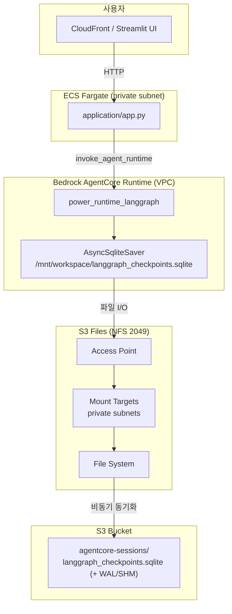

# Amazon S3 Files — Agent Runtime 적용 가이드

여기에서는 **Amazon S3 Files**가 무엇인지, **agent-runtime**에서 왜·어떻게 쓰는지, boto3로 생성하는 방법, 필요한 IAM 권한, Agent Runtime 연동 및 LangGraph checkpoint 동작을 설명합니다.

관련 코드:

- 인프라 생성: [installer.py](./installer.py) — `create_s3_files_session_storage()`
- Runtime 연결: [runtime_agent/langgraph/installer.py](./runtime_agent/langgraph/installer.py)
- Checkpoint 저장: [runtime_agent/langgraph/chat.py](./runtime_agent/langgraph/chat.py)
- 클라이언트 세션 ID: [application/agentcore_client.py](./application/agentcore_client.py)

---

## S3 Files란?

**Amazon S3 Files**는 기존 **Amazon S3 버킷**을 **NFS(Network File System)** 로 마운트해, 애플리케이션이 **일반 파일 I/O**(`open`, `write`, `mkdir`)로 읽고 쓸 수 있게 해 주는 관리형 파일시스템입니다.

| 관점 | 설명 |
|------|------|
| 백엔드 | 고객이 소유한 S3 버킷 (지정 prefix 아래 객체) |
| 클라이언트 인터페이스 | NFSv4.2 over TLS (포트 **2049**) |
| 동기화 | NFS에서 쓴 내용이 S3 객체로 **비동기 동기화** (보통 수십 초 지연) |
| 인증 | IAM 기반 (`s3files:ClientMount`, `ClientWrite` 등) |

S3 API로 `put_object`를 호출하는 것과 달리, 컨테이너 안에서는 **로컬 디렉터리**처럼 동작합니다. AgentCore Runtime은 이 경로를 `filesystemConfigurations`로 마운트합니다.

---

## 왜 써야 하나?

power-runtime은 AgentCore Runtime에서 **LangGraph 대화 checkpoint**를 `/mnt/workspace`에 영속화합니다. 저장 방식은 두 가지입니다.

| 방식 | API | Network | Version 업데이트 후 checkpoint | S3 버킷 동기화 |
|------|-----|---------|-------------------------------|----------------|
| Managed `sessionStorage` | `sessionStorage` | `PUBLIC` | **초기화될 수 있음** | 없음 (AWS 관리) |
| **S3 Files** (기본) | `s3FilesAccessPoint` | **VPC** | **유지** | 고객 S3 버킷 `agentcore-sessions/` |

Agent runtime이 S3 Files를 기본으로 쓰는 이유:

1. **배포 후에도 checkpoint 유지** — `update_agent_runtime`으로 이미지를 갱신해도 `langgraph_checkpoints.sqlite`가 S3에 남습니다.
2. **고객 버킷에서 확인 가능** — 콘솔/S3 API로 `agentcore-sessions/` prefix 아래 checkpoint 파일을 조회할 수 있습니다.
3. **LangGraph `AsyncSqliteSaver`와 자연스럽게 연동** — `SESSION_STORAGE_DIR=/mnt/workspace` 경로에 SQLite 파일을 저장합니다.
4. **VPC 보안** — Runtime을 private subnet에 두고 NFS(2049)만 mount target SG로 제한합니다.

`application/config.json`에 `s3_files_access_point_arn`이 없으면 Runtime installer는 managed `sessionStorage` + `PUBLIC` 모드로 fallback합니다.

---

## Agent runtime에서의 아키텍처



전체 트래픽 경로는 `CloudFront → ALB → ECS → (Bedrock AgentCore API) → Agent Runtime`입니다. ALB는 ECS Streamlit 앱에만 연결되며, Agent Runtime은 **동일 VPC의 private subnet**에 별도 microVM으로 기동됩니다.

**배포 예시** (`power-runtime` 설치 후):

| 항목 | 예시 값 |
|------|---------|
| S3 버킷 | `storage-for-power-runtime-{account_id}-us-west-2` |
| File system | `fs-xxxxxxxx` |
| Access point ARN | `arn:aws:s3files:us-west-2:{account_id}:file-system/fs-xxx/access-point/fsap-xxx` |
| Session prefix | `agentcore-sessions/` |
| Runtime mount path | `/mnt/workspace` |
| Checkpoint 파일 | `/mnt/workspace/langgraph_checkpoints.sqlite` |
| Runtime network | `VPC` (ECS와 동일 private subnets + `agent-runtime-sg-for-power-runtime`) |

S3 콘솔에서 checkpoint 경로 예:

```text
s3://storage-for-power-runtime-262976740991-us-west-2/
  agentcore-sessions/
    ... (S3 Files 내부 객체 구조)
    langgraph_checkpoints.sqlite
    langgraph_checkpoints.sqlite-wal   # WAL 활성 시
```

컨테이너 내부 경로:

```text
/mnt/workspace/
  langgraph_checkpoints.sqlite       # durable copy (S3 Files로 동기화)
  langgraph_checkpoints.sqlite-wal
  langgraph_checkpoints.sqlite-shm

/tmp/langgraph-checkpoints/<runtimeSessionId>/
  langgraph_checkpoints.sqlite       # 런타임 중 working copy
```

---

## 생성 흐름 (installer.py)

루트 [installer.py](./installer.py)의 `[5.5/10] Creating S3 Files session storage` 단계에서 **멱등**으로 다음을 생성합니다.

1. **Sync IAM role** — `role-s3files-sync-for-power-runtime` (S3 ↔ NFS 동기화)
2. **S3 bucket versioning** — `Enabled` (필수)
3. **File system** — bucket + prefix `agentcore-sessions/`
4. **Security groups** — runtime SG ↔ mount target SG (TCP 2049)
5. **Mount targets** — private subnet별 (ECS와 동일 subnet)
6. **Access point** — POSIX `uid/gid: 0/0`
7. **File system policy** — Runtime 실행 역할에 NFS mount/write 허용
8. **VPC endpoint SG 보강** — Bedrock Runtime endpoint에 agent-runtime SG 추가

결과는 `application/config.json`에 기록됩니다.

```json
{
  "s3_files_file_system_id": "fs-xxxxxxxx",
  "s3_files_access_point_arn": "arn:aws:s3files:us-west-2:...:access-point/fsap-...",
  "agent_runtime_vpc_subnets": ["subnet-...", "subnet-..."],
  "agent_runtime_security_groups": ["sg-..."]
}
```

이후 `install_agent_runtime("langgraph")`가 [runtime_agent/langgraph/installer.py](./runtime_agent/langgraph/installer.py)를 호출해 Agent Runtime을 S3 Files + VPC 모드로 생성·갱신합니다.

---

## Runtime 연결 (runtime_agent/langgraph/installer.py)

`session_storage_filesystem_configurations()`와 `agent_runtime_network_configuration()`이 `config.json` / `application/config.json` 값에 따라 자동 분기합니다.

| `s3_files_access_point_arn` | filesystemConfigurations | networkMode |
|-----------------------------|--------------------------|-------------|
| 있음 | `s3FilesAccessPoint` @ `/mnt/workspace` | `VPC` (subnets + securityGroups) |
| 없음 | `sessionStorage` @ `/mnt/workspace` | `PUBLIC` |

```python
# S3 Files 모드 (기본)
filesystemConfigurations=[{
    "s3FilesAccessPoint": {
        "accessPointArn": config["s3_files_access_point_arn"],
        "mountPath": "/mnt/workspace",
    },
}],
networkConfiguration={
    "networkMode": "VPC",
    "networkModeConfig": {
        "subnets": config["agent_runtime_vpc_subnets"],
        "securityGroups": config["agent_runtime_security_groups"],
    },
},
```

`create_agent_runtime`과 **`update_agent_runtime` 모두**에 위 설정을 포함해야 합니다. update 시 누락하면 cold start마다 checkpoint가 사라질 수 있습니다.

설치 성공 시 installer 로그 예:

```text
✓ s3FilesAccessPoint verified: mountPath=/mnt/workspace, arn=arn:aws:s3files:...
```

---

## boto3로 생성하기 (단계별 예제)

아래는 installer 로직을 축약한 **수동 프로비저닝** 예제입니다. 프로덕션에서는 `python3 installer.py` 사용을 권장합니다.

### 사전 조건

```python
import json
import time
import boto3

region = "us-west-2"
project_name = "power-runtime"
account_id = "262976740991"  # 본인 계정 ID
bucket_name = f"storage-for-{project_name}-{account_id}-{region}"
s3_bucket_arn = f"arn:aws:s3:::{bucket_name}"
session_prefix = "agentcore-sessions/"

s3 = boto3.client("s3", region_name=region)
iam = boto3.client("iam", region_name=region)
s3files = boto3.client("s3files", region_name=region)
ec2 = boto3.client("ec2", region_name=region)
```

### 1. S3 버킷 versioning 활성화

```python
s3.put_bucket_versioning(
    Bucket=bucket_name,
    VersioningConfiguration={"Status": "Enabled"},
)
```

### 2. S3 Files sync role 생성

S3 Files 서비스가 버킷과 동기화할 때 assume하는 역할입니다. 전체 정책은 [installer.py](./installer.py)의 `_get_or_create_s3files_sync_role()`을 참조하세요.

### 3. File system 생성

```python
fs = s3files.create_file_system(
    bucket=s3_bucket_arn,
    prefix=session_prefix,
    roleArn=sync_role_arn,
    acceptBucketWarning=True,
    tags=[{"key": "Name", "value": f"s3files-for-{project_name}"}],
)
file_system_id = fs["fileSystemId"]
```

### 4. Mount target 생성 (VPC private subnet)

```python
mt = s3files.create_mount_target(
    fileSystemId=file_system_id,
    subnetId=private_subnet_id,   # ECS·Runtime과 동일 private subnet
    securityGroups=[mount_sg_id],
)
```

Security group 규칙 (installer 기준):

- **Mount target SG** (`s3files-mount-sg-for-power-runtime`): ingress TCP 2049 from **agent runtime SG**
- **Agent runtime SG** (`agent-runtime-sg-for-power-runtime`): egress TCP 2049 to **mount target SG**

### 5. Access point 생성

```python
ap = s3files.create_access_point(
    fileSystemId=file_system_id,
    posixUser={"uid": 0, "gid": 0},
    rootDirectory={
        "path": "/",
        "creationPermissions": {
            "ownerUid": 0,
            "ownerGid": 0,
            "permissions": "0777",
        },
    },
)
access_point_arn = ap["accessPointArn"]
```

### 6. File system policy (resource-based)

Runtime **실행 역할 IAM만으로는 NFS 쓰기가 허용되지 않을 수 있습니다.** file system에 client policy를 반드시 설정합니다.

```python
agent_runtime_role_arn = (
    f"arn:aws:iam::{account_id}:role/AmazonBedrockAgentCoreRuntimeRoleFor{project_name}"
)

s3files.put_file_system_policy(
    fileSystemId=file_system_id,
    policy=json.dumps({
        "Version": "2012-10-17",
        "Statement": [{
            "Effect": "Allow",
            "Principal": {"AWS": agent_runtime_role_arn},
            "Action": [
                "s3files:ClientMount",
                "s3files:ClientWrite",
                "s3files:ClientRootAccess",
            ],
            "Condition": {
                "StringEquals": {
                    "s3files:AccessPointArn": access_point_arn,
                }
            },
        }],
    }),
)
```

### 7. AgentCore Runtime에 마운트 연결

```python
agentcore = boto3.client("bedrock-agentcore-control", region_name=region)

agentcore.update_agent_runtime(
    agentRuntimeId="power_runtime_langgraph-XXXXXXXX",
    description="S3 Files session storage",
    agentRuntimeArtifact={
        "containerConfiguration": {
            "containerUri": (
                f"{account_id}.dkr.ecr.{region}.amazonaws.com/"
                f"power-runtime_langgraph:20260628193044"
            ),
        },
    },
    filesystemConfigurations=[{
        "s3FilesAccessPoint": {
            "accessPointArn": access_point_arn,
            "mountPath": "/mnt/workspace",
        },
    }],
    networkConfiguration={
        "networkMode": "VPC",
        "networkModeConfig": {
            "subnets": ["subnet-aaa", "subnet-bbb"],
            "securityGroups": ["sg-runtime-xxx"],
        },
    },
    roleArn=agent_runtime_role_arn,
    protocolConfiguration={"serverProtocol": "HTTP"},
)
```

`mountPath`는 반드시 `/mnt/` 하위 1단계 경로여야 합니다 (예: `/mnt/workspace`).

수동 갱신 대신 다음 명령으로 자동 처리할 수 있습니다.

```bash
cd power-runtime/runtime_agent/langgraph
python3 installer.py
```

---

## 필요한 IAM 권한

S3 Files 연동에는 **세 종류**의 권한이 필요합니다.

### 1. Installer 실행 주체 (사용자/CI 역할)

S3 Files 리소스 CRUD, VPC/SG, IAM role 생성:

- `s3files:*` (또는 `CreateFileSystem`, `CreateAccessPoint`, `CreateMountTarget`, `PutFileSystemPolicy` 등)
- `ec2:*` (VPC, subnet, security group)
- `iam:*` (sync role, runtime role)
- `s3:PutBucketVersioning`

### 2. S3 Files sync role (`role-s3files-sync-for-power-runtime`)

| 정책 | 용도 |
|------|------|
| Trust | `elasticfilesystem.amazonaws.com` (S3 Files 서비스) |
| `s3-bucket-access` | 버킷·객체 read/write (동기화) |
| `eventbridge-sync` | `DO-NOT-DELETE-S3-Files*` 규칙 관리 |

### 3. AgentCore Runtime 실행 역할 (`AmazonBedrockAgentCoreRuntimeRoleForpower-runtime`)

**Identity-based policy** — `s3_files_access_point_arn`이 설정된 경우 Runtime installer의 `create_bedrock_agentcore_policy()`에 아래 statement가 추가되어야 합니다.

```python
file_system_arn = f"arn:aws:s3files:{region}:{account_id}:file-system/{file_system_id}"

# Statement 1: NFS mount/write
{
    "Sid": "S3FilesClientAccess",
    "Effect": "Allow",
    "Action": [
        "s3files:ClientMount",
        "s3files:ClientWrite",
        "s3files:ClientRootAccess",
    ],
    "Resource": file_system_arn,
    "Condition": {
        "ArnEquals": {"s3files:AccessPointArn": access_point_arn}
    },
}
# Statement 2: Runtime 생성/갱신 시 access point 검증
{
    "Sid": "S3FilesGetAccessPoint",
    "Effect": "Allow",
    "Action": ["s3files:GetAccessPoint"],
    "Resource": access_point_arn,  # file system ARN이 아님!
}
# Statement 3: mount target 검증
{
    "Sid": "S3FilesListMountTargets",
    "Effect": "Allow",
    "Action": ["s3files:ListMountTargets"],
    "Resource": file_system_arn,
}
```

> **주의:** `s3files:GetAccessPoint`의 `Resource`를 file system ARN으로만 지정하면 `update_agent_runtime` 시 `ValidationException: Ensure the role has s3files:GetAccessPoint`가 발생합니다. **access point ARN**을 별도 statement로 지정해야 합니다.

**Resource-based policy** (file system policy — installer가 `_ensure_s3files_file_system_policy()`로 설정):

```python
{
    "Effect": "Allow",
    "Principal": {"AWS": agent_runtime_role_arn},
    "Action": [
        "s3files:ClientMount",
        "s3files:ClientWrite",
        "s3files:ClientRootAccess",
    ],
    "Condition": {
        "StringEquals": {"s3files:AccessPointArn": access_point_arn}
    },
}
```

두 정책(identity + resource)이 **모두** 있어야 Runtime이 `/mnt/workspace`에 쓸 수 있습니다.

---

## 런타임 동작

### 1. Cold start — NFS 마운트

AgentCore Runtime이 VPC 모드로 기동되면:

1. `filesystemConfigurations.s3FilesAccessPoint`에 따라 access point를 NFS로 마운트
2. 마운트 경로 `/mnt/workspace`가 컨테이너에 노출
3. microVM 내부에서는 root(uid 0)로 파일 I/O 수행

[runtime_agent/langgraph/Dockerfile](./runtime_agent/langgraph/Dockerfile):

```dockerfile
ENV SESSION_STORAGE_DIR=/mnt/workspace
```

> Dockerfile의 `ENV`만으로는 영속 storage가 활성화되지 않습니다. **반드시** runtime API에 `filesystemConfigurations`를 설정해야 합니다.

### 2. runtimeSessionId — history 모드

[application/agentcore_client.py](./application/agentcore_client.py):

```python
def runtime_session_id_for(user_id: str, history_mode: str) -> str:
  if history_mode == "Enable" and user_id:
      seed = f"agentcore-session-{user_id}"
      session_id = str(uuid.uuid5(uuid.NAMESPACE_DNS, seed))
  else:
      session_id = str(uuid.uuid4())
  return session_id
```

history 모드가 `Enable`이면 **동일 user_id → 동일 runtimeSessionId**이므로, 재접속 후에도 같은 `/mnt/workspace`와 checkpoint를 이어서 읽을 수 있습니다.

### 3. Checkpoint 저장 — 이중 경로 패턴

[chat.py](./runtime_agent/langgraph/chat.py)는 NFS 잠금 이슈를 피하기 위해 **working DB**와 **영속 DB**를 분리합니다.

| 경로 | 역할 |
|------|------|
| `/tmp/langgraph-checkpoints/<session_id>/langgraph_checkpoints.sqlite` | 런타임 중 SQLite read/write (working) |
| `/mnt/workspace/langgraph_checkpoints.sqlite` | cold start·배포 후에도 유지되는 durable copy |

**cold start 시** (`ensure_checkpointer`):

1. `_restore_from_session_storage()` — `/mnt/workspace` → `/tmp/...` 복사
2. 기존 DB가 있으면 `SQLite checkpointer opened (existing)`
3. 없으면 `SQLite checkpointer initialized` (새 세션)

**요청 종료 시** ([agent.py](./runtime_agent/langgraph/agent.py), history 모드):

```python
finally:
    if history_mode == "Enable":
        await chat.persist_checkpoint_to_session_storage()
```

`persist_checkpoint_to_session_storage()`는 WAL checkpoint 후 working DB를 `/mnt/workspace`로 복사합니다. 이후 S3 Files가 버킷 `agentcore-sessions/`로 **비동기 동기화**합니다 (~60초 지연 가능).

### 4. thread_id와 checkpoint 범위

LangGraph checkpoint는 `config["configurable"]["thread_id"]`로 격리됩니다. `chat.py`는 `user_id`와 MCP/skill 구성 해시로 `thread_id`를 만들므로, 동일 사용자라도 tool 구성이 바뀌면 별도 checkpoint thread가 사용됩니다.

### 5. Managed sessionStorage와의 차이

| 시나리오 | Managed `sessionStorage` | S3 Files |
|----------|--------------------------|----------|
| stop/resume (같은 Version) | 유지 | 유지 |
| `update_agent_runtime` 후 | **초기화** | **유지** |
| 14일 미호출 | 초기화 | 고객 관리 |
| S3 콘솔에서 확인 | 불가 | `agentcore-sessions/` prefix |

### 6. aws-tavily Runtime과의 관계

power-runtime은 Marketplace Tavily MCP용 **별도 Runtime**(`agent_runtime_aws_tavily`, `us-east-1`)을 `PUBLIC` 모드로 운영합니다. S3 Files + VPC 설정은 **LangGraph 메인 Runtime**(`power_runtime_langgraph`)에만 적용됩니다.

---

## 네트워크 요구사항

S3 Files는 **VPC 전용**입니다.

| 항목 | 요구사항 |
|------|----------|
| Runtime `networkMode` | `VPC` |
| Subnets | S3 Files mount target과 **동일 AZ**의 private subnet (ECS와 동일) |
| Security group | Runtime SG → Mount SG **TCP 2049** egress/ingress |
| Bedrock VPC endpoint | Runtime SG가 endpoint SG에 포함 (installer가 자동 추가) |

위 조건이 맞지 않으면 invoke 시 **HTTP 424 (Failed Dependency)** 또는 mount 실패가 발생할 수 있습니다.

---

## 트러블슈팅

| 증상 | 원인 | 해결 |
|------|------|------|
| S3 bucket에 checkpoint 없음 | Runtime이 `PUBLIC` + `sessionStorage` 모드 | `python3 runtime_agent/langgraph/installer.py`로 S3 Files + VPC 재배포 |
| `Ensure the role has s3files:GetAccessPoint` | IAM `GetAccessPoint` Resource가 file system ARN | access point ARN으로 분리 (위 IAM 섹션 참조) |
| `Permission denied: /mnt/workspace/...` | file system policy 미설정 | `_ensure_s3files_file_system_policy()` 실행 또는 `python3 installer.py` 재실행 |
| 로그 `initialized` (매번 새 DB) | `filesystemConfigurations` 누락 또는 다른 `runtimeSessionId` | `get_agent_runtime`으로 mount 확인, history 모드·user_id 확인 |
| 로그 `opened (existing)`인데 UI에 history 없음 | `thread_id` 변경 (MCP/skill 구성 변경) | 동일 tool/skill 구성으로 재시도 |
| 버킷에 `agentcore-sessions/` 없음 | 동기화 지연 또는 persist 미호출 | 1~2분 대기, `history_mode=Enable` 및 `persist_checkpoint_to_session_storage` 확인 |
| HTTP 424 | SG(2049) 또는 AZ 불일치 | mount target·runtime subnet·SG 규칙 점검 |

CloudWatch 로그 그룹: `/aws/bedrock-agentcore/runtimes/power_runtime_langgraph-<id>-DEFAULT`

---

## 삭제

S3 Files 리소스는 **S3 버킷보다 먼저** 삭제해야 bucket 삭제가 성공합니다. 권장 순서:

1. AgentCore LangGraph Runtime 삭제 (`runtime_agent/langgraph/uninstaller.py`)
2. File system policy 삭제
3. Access point 삭제
4. Mount target 삭제
5. File system 삭제 (`forceDelete=True`)
6. Sync role (`role-s3files-sync-for-power-runtime`) 삭제
7. S3 bucket 삭제
8. `application/config.json`, `runtime_agent/langgraph/config.json` 정리

```bash
cd power-runtime
python3 uninstaller.py --yes
```

> 루트 `uninstaller.py`에 S3 Files 자동 삭제가 포함되지 않은 경우, 위 2~6단계는 콘솔 또는 `s3files` API로 수동 삭제하세요.

---

## 요약

| 질문 | 답 |
|------|-----|
| S3 Files란? | S3 버킷을 NFS로 마운트하는 관리형 파일시스템 |
| 왜 쓰나? | LangGraph checkpoint를 배포·Version 갱신 후에도 유지하고, 고객 S3에서 확인하려고 |
| power-runtime에서 어디에? | `/mnt/workspace/langgraph_checkpoints.sqlite` → S3 `agentcore-sessions/` |
| 어떻게 만드나? | `python3 installer.py` (또는 위 boto3 단계) |
| Runtime에 어떻게 연결? | `s3FilesAccessPoint` + `networkMode: VPC` (`runtime_agent/langgraph/installer.py`) |
| 핵심 권한? | sync role(S3+EventBridge), runtime role(3개 S3 Files statement), file system policy |
| 앱 코드 변경? | 없음 — `chat.py`의 `AsyncSqliteSaver` + `persist_checkpoint_to_session_storage()` 그대로 사용 |

더 자세한 배포 절차는 [README.md — Session Storage](./README.md#session-storage)를 참조하세요.
